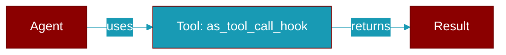

# as_tool_call_hook

<div className="flex items-center gap-2">
  <Badge color="teal">Function</Badge>
</div>

> This function is defined in the [**middleware**](../modules/middleware) module.

Adapt a plain ``on_tool_call`` callback into a ``before_tool`` hook.

``HooksConfig(on_tool_call=...)`` is routed onto the existing ``before_tool``
middleware slot, so it fires for every tool the agent executes (sync and
async paths both run through :class:`MiddlewareManager`). The callback
receives the :class:`ToolRequest`; its return value is ignored so the
request passes through unchanged.



## Signature

```python
def as_tool_call_hook(callback: Callable[[Any], Any]) -> BeforeToolFn
```

## Parameters

<ParamField query="callback" type="Callable" required={true}>
  No description available.
</ParamField>

### Returns

<ResponseField name="Returns" type="BeforeToolFn">
  The result of the operation.
</ResponseField>


## Source

<Card title="View on GitHub" icon="github" href="https://github.com/MervinPraison/PraisonAI/blob/main/src/praisonai-agents/praisonaiagents/hooks/middleware.py#L337">
  `praisonaiagents/hooks/middleware.py` at line 337
</Card>


---

## Related Documentation

<CardGroup cols={2}>
  <Card title="Tools Concept" icon="wrench" href="/docs/concepts/tools" />
  <Card title="Create Custom Tools" icon="plus" href="/docs/guides/tools/create-custom-tools" />
  <Card title="Tool Development" icon="code" href="/docs/tutorials/advanced-tool-development" />
  <Card title="Hooks Concept" icon="anchor" href="/docs/concepts/hooks" />
  <Card title="Hook Events" icon="bolt" href="/docs/features/hook-events" />
</CardGroup>
