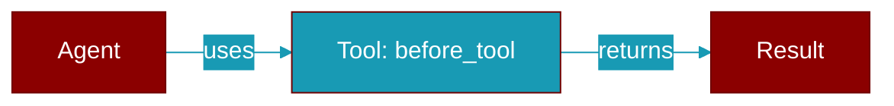

# before_tool

<div className="flex items-center gap-2">
  <Badge color="teal">Function</Badge>
</div>

> This function is defined in the [**middleware**](../modules/middleware) module.

Decorator to mark a function as a before_tool hook.

The function receives a ToolRequest and should return a (possibly modified) ToolRequest.



## Signature

```python
def before_tool(func: BeforeToolFn) -> BeforeToolFn
```

## Parameters

<ParamField query="func" type="BeforeToolFn" required={true}>
  No description available.
</ParamField>

### Returns

<ResponseField name="Returns" type="BeforeToolFn">
  The result of the operation.
</ResponseField>

## Usage

```python
@before_tool
    def validate_args(request):
        if 'dangerous' in request.arguments:
            raise ValueError("Dangerous argument detected")
        return request
```
