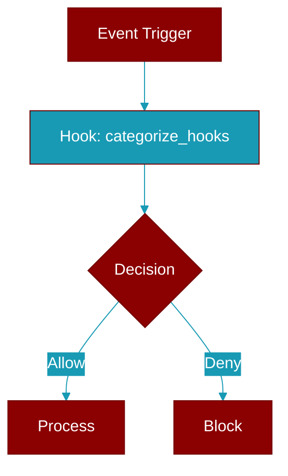

# categorize_hooks

<div className="flex items-center gap-2">
  <Badge color="teal">Function</Badge>
</div>

> This function is defined in the [**middleware**](../modules/middleware) module.

Categorize hooks by their type.



## Signature

```python
def categorize_hooks(hooks: List[Callable]) -> Dict[str, List[Callable]]
```

## Parameters

<ParamField query="hooks" type="List" required={true}>
  No description available.
</ParamField>

### Returns

<ResponseField name="Returns" type="Dict[str, List[Callable]]">
  before_model, after_model, wrap_model_call,
                   before_tool, after_tool, wrap_tool_call
</ResponseField>


## Source

<Card title="View on GitHub" icon="github" href="https://github.com/MervinPraison/PraisonAI/blob/main/src/praisonai-agents/praisonaiagents/hooks/middleware.py#L304">
  `praisonaiagents/hooks/middleware.py` at line 304
</Card>


---

## Related Documentation

<CardGroup cols={2}>
  <Card title="Hooks Concept" icon="anchor" href="/docs/concepts/hooks" />
  <Card title="Hook Events" icon="bolt" href="/docs/features/hook-events" />
  <Card title="Callbacks" icon="phone" href="/docs/features/callbacks" />
</CardGroup>
