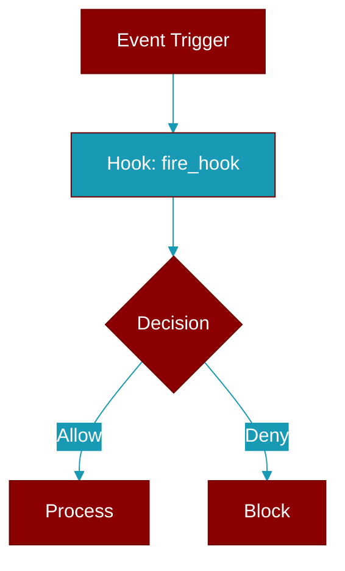

# fire_hook

<div className="flex items-center gap-2">
  <Badge color="teal">Function</Badge>
</div>

> This function is defined in the [**registry**](../modules/registry) module.

Emit a lifecycle event to every hook registered for it.

The emitting counterpart to :func:`add_hook`. Runtime components call this
at a real state transition (a kanban task created, a background job
finishing) so plugins subscribed to that :class:`HookEvent` actually hear
about it.

Best-effort by contract: an unknown event id, a malformed payload or a
raising subscriber is logged and swallowed — emitting an observability
event must never break the operation that produced it.



## Signature

```python
def fire_hook(event: Union[str, HookEvent], data: Optional[Dict]) -> List
```

## Parameters

<ParamField query="event" type="Union[str, HookEvent]" required={true}>
  ``HookEvent``, its canonical value, or its member name.
</ParamField>

<ParamField query="data" type="Optional[Dict]" required={false}>
  Payload; recognised keys populate the event's input dataclass and the remainder is carried through in ``extra``.
</ParamField>

### Returns

<ResponseField name="Returns" type="List">
  The hook execution results, or ``[]`` when there are no subscribers or
    the emission was scheduled on a already-running event loop.
</ResponseField>


## Uses

- `resolve_hook_event`
- `logger.debug`
- `get_default_registry`
- `reg.get_hooks`
- `HookRunner`
- `asyncio.get_running_loop`
- `loop.is_running`
- `loop.create_task`
- `runner.execute`
- `_PENDING_HOOK_TASKS.add`


## Source

<Card title="View on GitHub" icon="github" href="https://github.com/MervinPraison/PraisonAI/blob/main/src/praisonai-agents/praisonaiagents/hooks/registry.py#L548">
  `praisonaiagents/hooks/registry.py` at line 548
</Card>


---

## Related Documentation

<CardGroup cols={2}>
  <Card title="Hooks Concept" icon="anchor" href="/docs/concepts/hooks" />
  <Card title="Hook Events" icon="bolt" href="/docs/features/hook-events" />
  <Card title="Callbacks" icon="phone" href="/docs/features/callbacks" />
</CardGroup>
