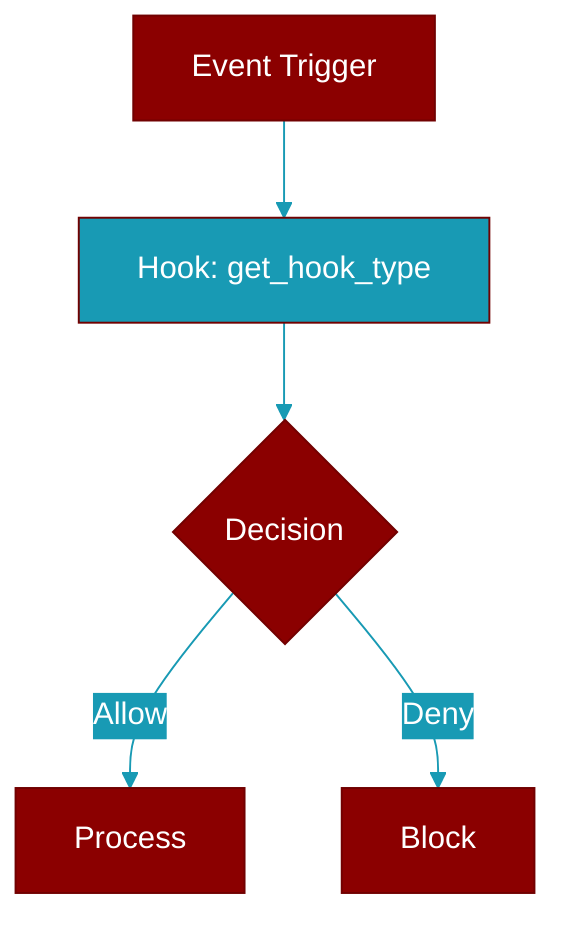

<div className="flex items-center gap-2">
  <Badge color="teal">Function</Badge>
</div>

> This function is defined in the [**middleware**](../modules/middleware) module.

Get the hook type of a decorated function.



## Signature

```python
def get_hook_type(func: Callable) -> Optional[str]
```

## Parameters

<ParamField query="func" type="Callable" required={true}>
  No description available.
</ParamField>

### Returns

<ResponseField name="Returns" type="Optional[str]">
  The result of the operation.
</ResponseField>
