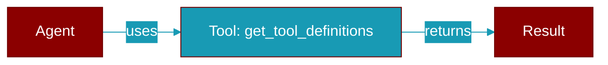

# get_tool_definitions

<div className="flex items-center gap-2">
  <Badge color="teal">Function</Badge>
</div>

> This function is defined in the [**registry**](../modules/registry) module.

Get OpenAI-compatible tool definitions with dynamic schema overrides applied.

This is the main entry point for getting tool schemas that respects
dynamic overrides. Called every time tools need to be passed to the LLM.



## Signature

```python
def get_tool_definitions(permission_resolver: Optional[Callable[[str], bool]]) -> List[Dict[str, Any]]
```

## Parameters

<ParamField query="permission_resolver" type="Optional" required={false}>
  Optional ``(tool_name) -&gt; bool`` filter; denied tools are dropped from the advertised schema (deny = hide).
</ParamField>

### Returns

<ResponseField name="Returns" type="List[Dict[str, Any]]">
  List of OpenAI-compatible tool definition dictionaries
</ResponseField>


## Uses

- `get_tool_definitions`
- `get_registry`


## Used By

- [`get_tool_definitions`](../functions/get_tool_definitions)


## Source

<Card title="View on GitHub" icon="github" href="https://github.com/MervinPraison/PraisonAI/blob/main/src/praisonai-agents/praisonaiagents/tools/registry.py#L642">
  `praisonaiagents/tools/registry.py` at line 642
</Card>


---

## Related Documentation

<CardGroup cols={2}>
  <Card title="Tools Concept" icon="wrench" href="/docs/concepts/tools" />
  <Card title="Create Custom Tools" icon="plus" href="/docs/guides/tools/create-custom-tools" />
  <Card title="Tool Development" icon="code" href="/docs/tutorials/advanced-tool-development" />
</CardGroup>
