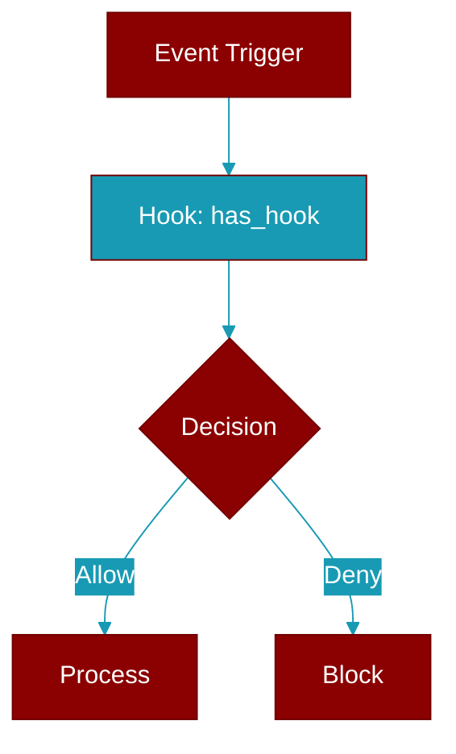

<div className="flex items-center gap-2">
  <Badge color="teal">Function</Badge>
</div>

> This function is defined in the [**registry**](../modules/registry) module.

Check if any hooks are registered for an event. Simplified API.

Accepts both string event names and HookEvent enums:
    has_hook('before_tool')  # String
    has_hook(HookEvent.BEFORE_TOOL)  # Enum



## Signature

```python
def has_hook(event: Union[str, HookEvent]) -> bool
```

## Parameters

<ParamField query="event" type="Union" required={true}>
  Hook event name or HookEvent enum
</ParamField>

### Returns

<ResponseField name="Returns" type="bool">
  True if hooks are registered for this event
</ResponseField>

### Exceptions

<AccordionGroup>
  <Accordion title="ValueError">
    If event string is not a valid HookEvent
  </Accordion>
</AccordionGroup>
