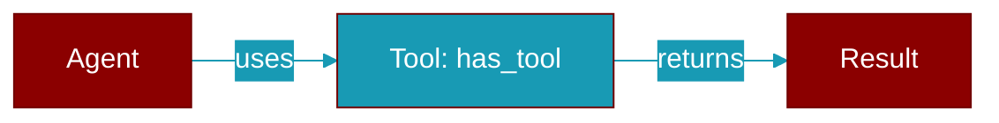

# has_tool

<div className="flex items-center gap-2">
  <Badge color="teal">Function</Badge>
</div>

> This function is defined in the [**registry**](../modules/registry) module.

Check if a tool is registered in the global registry.



## Signature

```python
def has_tool(name: str) -> bool
```

## Parameters

<ParamField query="name" type="str" required={true}>
  Name of the tool to check
</ParamField>

### Returns

<ResponseField name="Returns" type="bool">
  True if tool exists, False otherwise
</ResponseField>


## Uses

- `get_registry`


## Source

<Card title="View on GitHub" icon="github" href="https://github.com/MervinPraison/PraisonAI/blob/main/src/praisonai-agents/praisonaiagents/tools/registry.py#L609">
  `praisonaiagents/tools/registry.py` at line 609
</Card>


---

## Related Documentation

<CardGroup cols={2}>
  <Card title="Tools Concept" icon="wrench" href="/docs/concepts/tools" />
  <Card title="Create Custom Tools" icon="plus" href="/docs/guides/tools/create-custom-tools" />
  <Card title="Tool Development" icon="code" href="/docs/tutorials/advanced-tool-development" />
</CardGroup>
