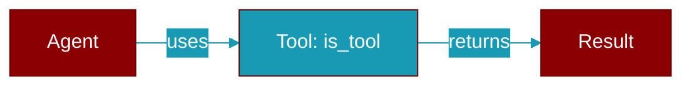

# is_tool

<div className="flex items-center gap-2">
  <Badge color="teal">Function</Badge>
</div>

> This function is defined in the [**decorator**](../modules/decorator) module.

Check if an object is a tool (BaseTool instance or decorated function).



## Signature

```python
def is_tool(obj: Any) -> bool
```

## Parameters

<ParamField query="obj" type="Any" required={true}>
  No description available.
</ParamField>

### Returns

<ResponseField name="Returns" type="bool">
  The result of the operation.
</ResponseField>


## Source

<Card title="View on GitHub" icon="github" href="https://github.com/MervinPraison/PraisonAI/blob/main/src/praisonai-agents/praisonaiagents/tools/decorator.py#L380">
  `praisonaiagents/tools/decorator.py` at line 380
</Card>


---

## Related Documentation

<CardGroup cols={2}>
  <Card title="Tools Concept" icon="wrench" href="/docs/concepts/tools" />
  <Card title="Create Custom Tools" icon="plus" href="/docs/guides/tools/create-custom-tools" />
  <Card title="Tool Development" icon="code" href="/docs/tutorials/advanced-tool-development" />
</CardGroup>
