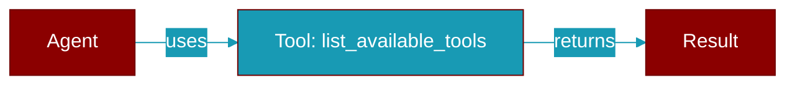

# list_available_tools

<div className="flex items-center gap-2">
  <Badge color="teal">Function</Badge>
</div>

> This function is defined in the [**registry**](../modules/registry) module.

List only currently available tools from the global registry.



## Signature

```python
def list_available_tools(context: Optional[Dict[str, Any]], ttl_seconds: Optional[float]) -> List[Union[BaseTool, Callable]]
```

## Parameters

<ParamField query="context" type="Optional" required={false}>
  Optional context for availability checks
</ParamField>

<ParamField query="ttl_seconds" type="Optional[float]" required={false}>
  Cache TTL override (default: 30.0 seconds)
</ParamField>

### Returns

<ResponseField name="Returns" type="List[Union[BaseTool, Callable]]">
  List of available tools
</ResponseField>


## Uses

- `list_available_tools`
- `get_registry`


## Used By

- [`list_available_tools`](../functions/list_available_tools)


## Source

<Card title="View on GitHub" icon="github" href="https://github.com/MervinPraison/PraisonAI/blob/main/src/praisonai-agents/praisonaiagents/tools/registry.py#L673">
  `praisonaiagents/tools/registry.py` at line 673
</Card>


---

## Related Documentation

<CardGroup cols={2}>
  <Card title="Tools Concept" icon="wrench" href="/docs/concepts/tools" />
  <Card title="Create Custom Tools" icon="plus" href="/docs/guides/tools/create-custom-tools" />
  <Card title="Tool Development" icon="code" href="/docs/tutorials/advanced-tool-development" />
</CardGroup>
