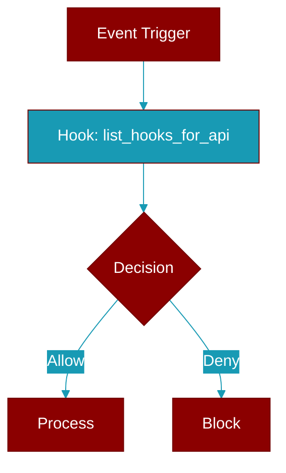

# list_hooks_for_api

<div className="flex items-center gap-2">
  <Badge color="teal">Function</Badge>
</div>

> This function is defined in the [**registry**](../modules/registry) module.

Flat hook list suitable for REST/UI consumers.



## Signature

```python
def list_hooks_for_api() -> List[Dict]
```

### Returns

<ResponseField name="Returns" type="List[Dict]">
  The result of the operation.
</ResponseField>


## Uses

- `get_default_registry`
- `registry.list_hooks`


## Source

<Card title="View on GitHub" icon="github" href="https://github.com/MervinPraison/PraisonAI/blob/main/src/praisonai-agents/praisonaiagents/hooks/registry.py#L443">
  `praisonaiagents/hooks/registry.py` at line 443
</Card>


---

## Related Documentation

<CardGroup cols={2}>
  <Card title="Hooks Concept" icon="anchor" href="/docs/concepts/hooks" />
  <Card title="Hook Events" icon="bolt" href="/docs/features/hook-events" />
  <Card title="Callbacks" icon="phone" href="/docs/features/callbacks" />
</CardGroup>
