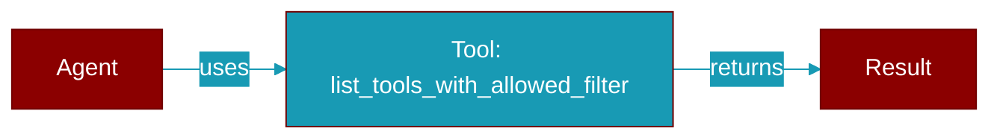

# list_tools_with_allowed_filter

<div className="flex items-center gap-2">
  <Badge color="teal">Function</Badge>
</div>

> This function is defined in the [**registry**](../modules/registry) module.

List tool names filtered by ALLOWED_TOOLS from the global registry.

This is the canonical entry point for applying ALLOWED_TOOLS filtering
across the PraisonAI ecosystem.



## Signature

```python
def list_tools_with_allowed_filter(context: Optional[Dict[str, Any]]) -> List[str]
```

## Parameters

<ParamField query="context" type="Optional" required={false}>
  Optional context for availability checks
</ParamField>

### Returns

<ResponseField name="Returns" type="List[str]">
  List of filtered tool names
</ResponseField>


## Uses

- `list_tools_with_allowed_filter`
- `get_registry`


## Used By

- [`list_tools_with_allowed_filter`](../functions/list_tools_with_allowed_filter)
- [`list_tools_with_hermes_filter`](../functions/list_tools_with_hermes_filter)


## Source

<Card title="View on GitHub" icon="github" href="https://github.com/MervinPraison/PraisonAI/blob/main/src/praisonai-agents/praisonaiagents/tools/registry.py#L689">
  `praisonaiagents/tools/registry.py` at line 689
</Card>


---

## Related Documentation

<CardGroup cols={2}>
  <Card title="Tools Concept" icon="wrench" href="/docs/concepts/tools" />
  <Card title="Create Custom Tools" icon="plus" href="/docs/guides/tools/create-custom-tools" />
  <Card title="Tool Development" icon="code" href="/docs/tutorials/advanced-tool-development" />
</CardGroup>
