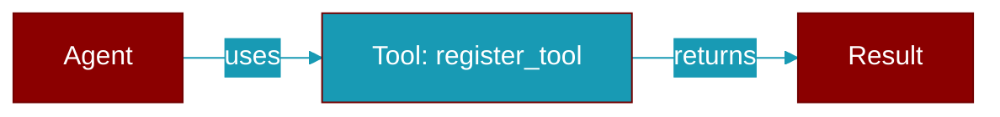

# register_tool

<div className="flex items-center gap-2">
  <Badge color="teal">Function</Badge>
</div>

> This function is defined in the [**registry**](../modules/registry) module.

Convenience function to register a tool with the global registry.



## Signature

```python
def register_tool(tool: Union[BaseTool, Callable], name: Optional[str], trust_level: Optional[str], dynamic_schema_overrides: Optional[Callable[[Dict[str, Any]], Dict[str, Any]]]) -> None
```

## Parameters

<ParamField query="tool" type="Union[BaseTool, Callable]" required={true}>
  No description available.
</ParamField>

<ParamField query="name" type="Optional[str]" required={false}>
  No description available.
</ParamField>

<ParamField query="trust_level" type="Optional[str]" required={false}>
  No description available.
</ParamField>

<ParamField query="dynamic_schema_overrides" type="Optional" required={false}>
  No description available.
</ParamField>


## Uses

- `register`
- `get_registry`


## Used By

- [`add_tool`](../functions/add_tool)


## Source

<Card title="View on GitHub" icon="github" href="https://github.com/MervinPraison/PraisonAI/blob/main/src/praisonai-agents/praisonaiagents/tools/registry.py#L576">
  `praisonaiagents/tools/registry.py` at line 576
</Card>


---

## Related Documentation

<CardGroup cols={2}>
  <Card title="Tools Concept" icon="wrench" href="/docs/concepts/tools" />
  <Card title="Create Custom Tools" icon="plus" href="/docs/guides/tools/create-custom-tools" />
  <Card title="Tool Development" icon="code" href="/docs/tutorials/advanced-tool-development" />
</CardGroup>
