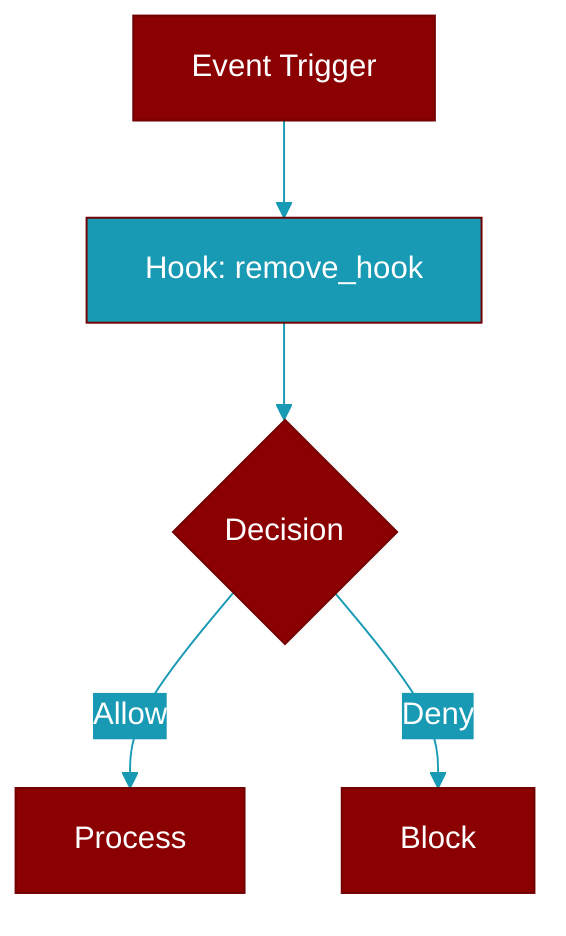

# remove_hook

<div className="flex items-center gap-2">
  <Badge color="teal">Function</Badge>
</div>

> This function is defined in the [**registry**](../modules/registry) module.

Remove a hook by ID. Simplified API.



## Signature

```python
def remove_hook(hook_id: str) -> bool
```

## Parameters

<ParamField query="hook_id" type="str" required={true}>
  The hook ID returned by add_hook()
</ParamField>

### Returns

<ResponseField name="Returns" type="bool">
  True if hook was found and removed, False otherwise
</ResponseField>


## Uses

- `unregister`
- `get_default_registry`


## Source

<Card title="View on GitHub" icon="github" href="https://github.com/MervinPraison/PraisonAI/blob/main/src/praisonai-agents/praisonaiagents/hooks/registry.py#L404">
  `praisonaiagents/hooks/registry.py` at line 404
</Card>


---

## Related Documentation

<CardGroup cols={2}>
  <Card title="Hooks Concept" icon="anchor" href="/docs/concepts/hooks" />
  <Card title="Hook Events" icon="bolt" href="/docs/features/hook-events" />
  <Card title="Callbacks" icon="phone" href="/docs/features/callbacks" />
</CardGroup>
