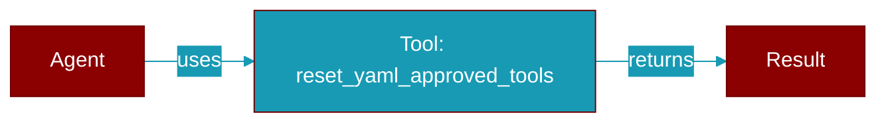

# reset_yaml_approved_tools

<div className="flex items-center gap-2">
  <Badge color="teal">Function</Badge>
</div>

> This function is defined in the [**approval**](../modules/approval) module.

Reset YAML-approved tools to previous state.



## Signature

```python
def reset_yaml_approved_tools(token: contextvars.Token) -> None
```

## Parameters

<ParamField query="token" type="contextvars.Token" required={true}>
  No description available.
</ParamField>
