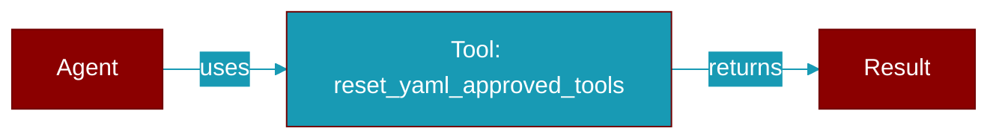

# reset_yaml_approved_tools

<div className="flex items-center gap-2">
  <Badge color="teal">Function</Badge>
</div>

> This function is defined in the [**approval**](../modules/approval) module.



```mermaid
%%{init: {'theme': 'base', 'themeVariables': { 'primaryColor': '#8B0000', 'primaryTextColor': '#fff', 'primaryBorderColor': '#710101', 'lineColor': '#189AB4', 'secondaryColor': '#189AB4', 'tertiaryColor': '#fff' }}}%%

graph LR
    agent["Agent"] -- "uses" --> tool["Tool: reset_yaml_approved_tools"]
    tool -- "returns" --> result["Result"]
    style tool fill:#189AB4,color:#fff
    style agent fill:#8B0000,color:#fff
    style result fill:#8B0000,color:#fff
```

## Signature

```python
def reset_yaml_approved_tools(token: contextvars.Token) -> None
```

## Parameters

<ParamField query="token" type="contextvars.Token" required={true}>
  No description available.
</ParamField>


## Uses

- `reset_yaml_approved_tools`
- `get_approval_registry`


## Used By

- [`reset_yaml_approved_tools`](../functions/reset_yaml_approved_tools)


## Source

<Card title="View on GitHub" icon="github" href="https://github.com/MervinPraison/PraisonAI/blob/main/src/praisonai-agents/praisonaiagents/approval/__init__.py#L126">
  `praisonaiagents/approval/__init__.py` at line 126
</Card>


---

## Related Documentation

<CardGroup cols={2}>
  <Card title="Tools Concept" icon="wrench" href="/docs/concepts/tools" />
  <Card title="Create Custom Tools" icon="plus" href="/docs/guides/tools/create-custom-tools" />
  <Card title="Tool Development" icon="code" href="/docs/tutorials/advanced-tool-development" />
</CardGroup>
