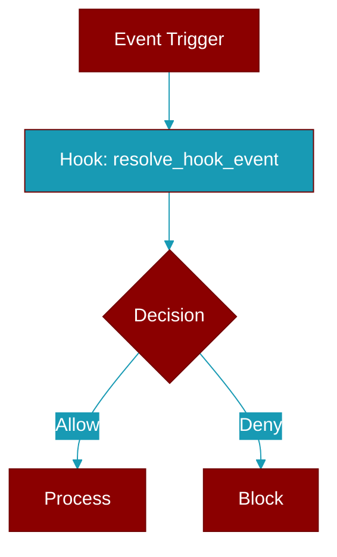

# resolve_hook_event

<div className="flex items-center gap-2">
  <Badge color="teal">Function</Badge>
</div>

> This function is defined in the [**registry**](../modules/registry) module.

Resolve an event id to a :class:`HookEvent`, or ``None`` if unknown.

Accepts the enum itself, its canonical value (``"kanban_task_moved"``) and
its member name (``"KANBAN_TASK_MOVED"``). Emitting call sites historically
used the member name, so both spellings must reach the same subscribers.



## Signature

```python
def resolve_hook_event(event: Union[str, HookEvent]) -> Optional[HookEvent]
```

## Parameters

<ParamField query="event" type="Union[str, HookEvent]" required={true}>
  No description available.
</ParamField>

### Returns

<ResponseField name="Returns" type="Optional[HookEvent]">
  The result of the operation.
</ResponseField>


## Uses

- `HookEvent`


## Used By

- [`fire_hook`](../functions/fire_hook)


## Source

<Card title="View on GitHub" icon="github" href="https://github.com/MervinPraison/PraisonAI/blob/main/src/praisonai-agents/praisonaiagents/hooks/registry.py#L488">
  `praisonaiagents/hooks/registry.py` at line 488
</Card>


---

## Related Documentation

<CardGroup cols={2}>
  <Card title="Hooks Concept" icon="anchor" href="/docs/concepts/hooks" />
  <Card title="Hook Events" icon="bolt" href="/docs/features/hook-events" />
  <Card title="Callbacks" icon="phone" href="/docs/features/callbacks" />
</CardGroup>
