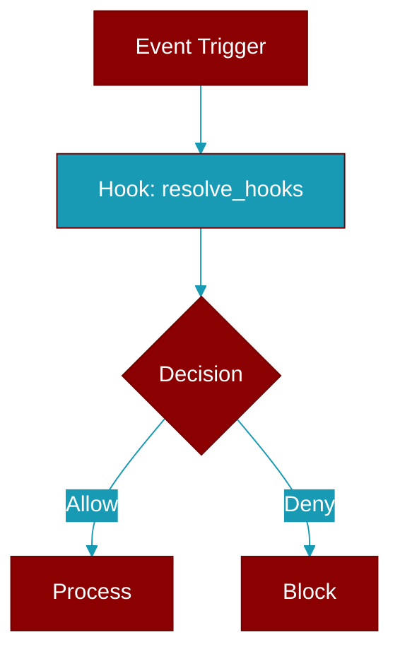

# resolve_hooks

<div className="flex items-center gap-2">
  <Badge color="teal">Function</Badge>
</div>

> This function is defined in the [**param_resolver**](../modules/param_resolver) module.

Resolve hooks parameter.



## Signature

```python
def resolve_hooks(value: Any, config_class: Optional[Type]) -> Any
```

## Parameters

<ParamField query="value" type="Any" required={true}>
  No description available.
</ParamField>

<ParamField query="config_class" type="Optional" required={false}>
  No description available.
</ParamField>

### Returns

<ResponseField name="Returns" type="Any">
  The result of the operation.
</ResponseField>
