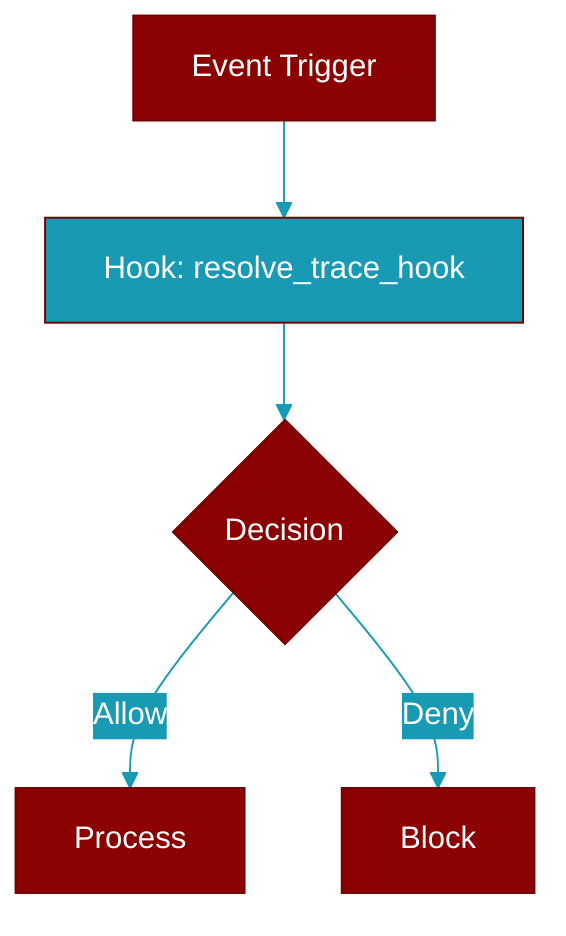

# resolve_trace_hook

<div className="flex items-center gap-2">
  <Badge color="teal">Function</Badge>
</div>

> This function is defined in the [**protocols**](../modules/protocols) module.

Return ``hook`` when a tracer is supplied, else the no-op default.

A tiny helper so a gateway can accept an optional ``tracer=`` argument and
always hold a callable hook without branching on ``None`` at every stage.



## Signature

```python
def resolve_trace_hook(hook: 'Optional[GatewayTraceHook]') -> 'GatewayTraceHook'
```

## Parameters

<ParamField query="hook" type="'Optional[GatewayTraceHook]'" required={true}>
  A user/plugin-supplied trace hook, or ``None``.
</ParamField>

### Returns

<ResponseField name="Returns" type="'GatewayTraceHook'">
  data:`NULL_GATEWAY_TRACE_HOOK`.
</ResponseField>


## Source

<Card title="View on GitHub" icon="github" href="https://github.com/MervinPraison/PraisonAI/blob/main/src/praisonai-agents/praisonaiagents/gateway/protocols.py#L4981">
  `praisonaiagents/gateway/protocols.py` at line 4981
</Card>


---

## Related Documentation

<CardGroup cols={2}>
  <Card title="Hooks Concept" icon="anchor" href="/docs/concepts/hooks" />
  <Card title="Hook Events" icon="bolt" href="/docs/features/hook-events" />
  <Card title="Callbacks" icon="phone" href="/docs/features/callbacks" />
</CardGroup>
