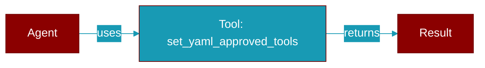

# set_yaml_approved_tools

<div className="flex items-center gap-2">
  <Badge color="teal">Function</Badge>
</div>

> This function is defined in the [**approval**](../modules/approval) module.

Set the list of YAML-approved tools for the current context.

This is called by the workflow runner when parsing agents.yaml with approve field.



## Signature

```python
def set_yaml_approved_tools(tools: List[str]) -> contextvars.Token
```

## Parameters

<ParamField query="tools" type="List" required={true}>
  List of tool names to auto-approve
</ParamField>

### Returns

<ResponseField name="Returns" type="contextvars.Token">
  Token that can be used to reset the context
</ResponseField>


---

## Related Documentation

<CardGroup cols={2}>
  <Card title="Tools Concept" icon="wrench" href="/docs/concepts/tools" />
  <Card title="Create Custom Tools" icon="plus" href="/docs/guides/tools/create-custom-tools" />
  <Card title="Tool Development" icon="code" href="/docs/tutorials/advanced-tool-development" />
</CardGroup>
