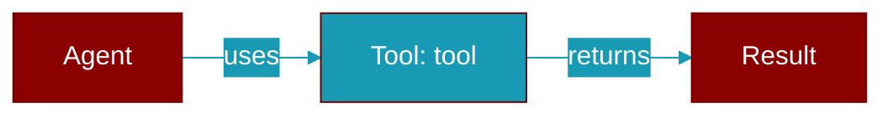

# tool

<div className="flex items-center gap-2">
  <Badge color="teal">Function</Badge>
</div>

> This function is defined in the [**decorator**](../modules/decorator) module.

Decorator to convert a function into a tool.

Can be used with or without arguments:

    @tool
    def my_func(x: str) -&gt; str:
        '''Does something.'''
        return x
    
    @tool(name="custom_name", description="Custom description")
    def my_func(x: str) -&gt; str:
        return x
        
    @tool(availability=lambda: (bool(os.getenv("API_KEY")), "API_KEY missing"))
    def my_func(x: str) -&gt; str:
        return x
        
    @tool(retry_policy=RetryPolicy(max_attempts=5))
    def my_func(x: str) -&gt; str:
        return x

    @tool(approval=True)
    def delete_account(user_id: str) -&gt; str:
        return "deleted"

    @tool(approval="critical")
    def deploy(env: str) -&gt; str:
        return "deployed"



## Signature

```python
def tool(func: Optional[Callable]) -> Union[FunctionTool, Callable[[Callable], FunctionTool]]
```

## Parameters

<ParamField query="func" type="Optional[Callable]" required={false}>
  The function to wrap (when used without parentheses)
</ParamField>

### Returns

<ResponseField name="Returns" type="Union[FunctionTool, Callable[[Callable], FunctionTool]]">
  FunctionTool instance that wraps the function
</ResponseField>


## Uses

- `FunctionTool`
- `add_approval_requirement`
- `RuntimeError`
- `tool_instance.validate`
- `tool_instance.validate_schema_roundtrip`
- `logging.warning`
- `logging.debug`
- `get_registry`
- `registry.register`
- `decorator`


## Source

<Card title="View on GitHub" icon="github" href="https://github.com/MervinPraison/PraisonAI/blob/main/src/praisonai-agents/praisonaiagents/tools/decorator.py#L232">
  `praisonaiagents/tools/decorator.py` at line 232
</Card>


---

## Related Documentation

<CardGroup cols={2}>
  <Card title="Tools Concept" icon="wrench" href="/docs/concepts/tools" />
  <Card title="Create Custom Tools" icon="plus" href="/docs/guides/tools/create-custom-tools" />
  <Card title="Tool Development" icon="code" href="/docs/tutorials/advanced-tool-development" />
</CardGroup>
