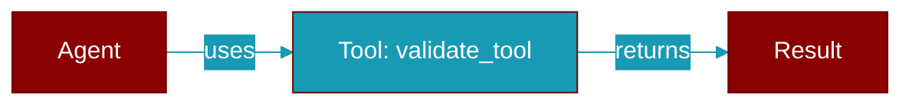

# validate_tool

<div className="flex items-center gap-2">
  <Badge color="teal">Function</Badge>
</div>

> This function is defined in the [**base**](../modules/base) module.

Validate any tool-like object.



## Signature

```python
def validate_tool(tool: Any) -> bool
```

## Parameters

<ParamField query="tool" type="Any" required={true}>
  Object to validate (BaseTool, callable, etc.)
</ParamField>

### Returns

<ResponseField name="Returns" type="bool">
  True if valid
</ResponseField>

### Exceptions

<AccordionGroup>
  <Accordion title="ToolValidationError">
    If validation fails
  </Accordion>
</AccordionGroup>


## Uses

- `tool.validate`
- `tool.validate_schema_roundtrip`
- `callable`
- `ToolValidationError`


## Used By

- [`validate_tool_schema_consistency`](../functions/validate_tool_schema_consistency)


## Source

<Card title="View on GitHub" icon="github" href="https://github.com/MervinPraison/PraisonAI/blob/main/src/praisonai-agents/praisonaiagents/tools/base.py#L467">
  `praisonaiagents/tools/base.py` at line 467
</Card>


---

## Related Documentation

<CardGroup cols={2}>
  <Card title="Tools Concept" icon="wrench" href="/docs/concepts/tools" />
  <Card title="Create Custom Tools" icon="plus" href="/docs/guides/tools/create-custom-tools" />
  <Card title="Tool Development" icon="code" href="/docs/tutorials/advanced-tool-development" />
</CardGroup>
