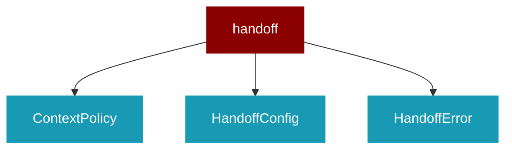

# handoff

<Badge color="blue">Core SDK</Badge>

## Overview



Handoff functionality for agent-to-agent delegation.

This module provides handoff capabilities that allow agents to delegate tasks
to other agents, similar to the OpenAI Agents SDK implementation.

Unified Handoff System:
- Handoff: LLM-driven (tool call) or programmatic agent-to-agent transfer
- HandoffConfig: Configuration for context policy, timeouts, concurrency, safety
- Replaces/absorbs Agent.delegate() and SubagentDelegator functionality

## Import

```python
from praisonaiagents import handoff
```

## Classes

<AccordionGroup>
### ContextPolicy

*Extends: Enum*

Policy for context sharing during handoff.

### HandoffConfig

Unified configuration for handoff behavior.

This consolidates all handoff-related settings including context policy,
timeouts, concurrency control, and safety features.

Attributes:
    context_policy: How to share context during handoff (default: summary for safety)
    max_context_tokens: Maximum tokens to include in context
    max_context_messages: Maximum messages to include (for LAST_N policy)
    preserve_system: Whether to preserve system messages in context
    timeout_seconds: Timeout for handoff execution
    max_concurrent: Maximum concurrent handoffs (0 = unlimited)
    detect_cycles: Enable cycle detection to prevent infinite loops
    max_depth: Maximum handoff chain depth
    async_mode: Enable async execution
    on_handoff: Callback when handoff starts
    on_complete: Callback when handoff completes
    on_error: Callback when handoff fails

<Expandable title="Properties">

<ResponseField name="context_policy" type="ContextPolicy">
</ResponseField>
<ResponseField name="max_context_tokens" type="int">
</ResponseField>
<ResponseField name="max_context_messages" type="int">
</ResponseField>
<ResponseField name="preserve_system" type="bool">
</ResponseField>
<ResponseField name="timeout_seconds" type="float">
</ResponseField>
<ResponseField name="max_concurrent" type="int">
</ResponseField>
<ResponseField name="detect_cycles" type="bool">
</ResponseField>
<ResponseField name="max_depth" type="int">
</ResponseField>
<ResponseField name="async_mode" type="bool">
</ResponseField>
<ResponseField name="on_handoff" type="Optional">
</ResponseField>
<ResponseField name="on_complete" type="Optional">
</ResponseField>
<ResponseField name="on_error" type="Optional">
</ResponseField>

</Expandable>

<AccordionGroup>
<Accordion title="to_dict() -> Dict">
  Convert config to dictionary.
</Accordion>
</AccordionGroup>

### HandoffError

*Extends: Exception*

Base exception for handoff errors.

### HandoffCycleError

*Extends: HandoffError*

Raised when a cycle is detected in handoff chain.

<Expandable title="Constructor Parameters">

<ParamField query="chain" type="List">
   (Required)
</ParamField>

</Expandable>

### HandoffDepthError

*Extends: HandoffError*

Raised when max handoff depth is exceeded.

<Expandable title="Constructor Parameters">

<ParamField query="depth" type="int">
   (Required)
</ParamField>
<ParamField query="max_depth" type="int">
   (Required)
</ParamField>

</Expandable>

### HandoffTimeoutError

*Extends: HandoffError*

Raised when handoff times out.

<Expandable title="Constructor Parameters">

<ParamField query="timeout" type="float">
   (Required)
</ParamField>
<ParamField query="agent_name" type="str">
   (Required)
</ParamField>

</Expandable>

### HandoffInputData

Data passed to a handoff target agent.

<Expandable title="Properties">

<ResponseField name="messages" type="list">
</ResponseField>
<ResponseField name="context" type="Dict">
</ResponseField>
<ResponseField name="source_agent" type="Optional">
</ResponseField>
<ResponseField name="handoff_depth" type="int">
</ResponseField>
<ResponseField name="handoff_chain" type="List">
</ResponseField>

</Expandable>

### HandoffResult

Result of a handoff operation.

<Expandable title="Properties">

<ResponseField name="success" type="bool">
</ResponseField>
<ResponseField name="response" type="Optional">
</ResponseField>
<ResponseField name="target_agent" type="Optional">
</ResponseField>
<ResponseField name="source_agent" type="Optional">
</ResponseField>
<ResponseField name="duration_seconds" type="float">
</ResponseField>
<ResponseField name="error" type="Optional">
</ResponseField>
<ResponseField name="handoff_depth" type="int">
</ResponseField>

</Expandable>

### Handoff

Represents a handoff configuration for delegating tasks to another agent.

Handoffs are represented as tools to the LLM, allowing agents to transfer
control to specialized agents for specific tasks.

This is the unified mechanism for agent-to-agent task transfer, supporting:
- LLM-driven handoffs (via tool calls)
- Programmatic handoffs (direct Python API)
- Async handoffs with concurrency control
- Cycle detection and depth limiting
- Configurable context policies

<Expandable title="Constructor Parameters">

<ParamField query="agent" type="Agent">
   (Required)
</ParamField>
<ParamField query="tool_name_override" type="Optional">
   (default: `None`)
</ParamField>
<ParamField query="tool_description_override" type="Optional">
   (default: `None`)
</ParamField>
<ParamField query="on_handoff" type="Optional">
   (default: `None`)
</ParamField>
<ParamField query="input_type" type="Optional">
   (default: `None`)
</ParamField>
<ParamField query="input_filter" type="Optional">
   (default: `None`)
</ParamField>
<ParamField query="config" type="Optional">
   (default: `None`)
</ParamField>

</Expandable>

<AccordionGroup>
<Accordion title="tool_name() -> str">
  Get the tool name for this handoff.
</Accordion>
<Accordion title="tool_description() -> str">
  Get the tool description for this handoff.
</Accordion>
<Accordion title="default_tool_name() -> str">
  Generate default tool name based on agent name.
</Accordion>
<Accordion title="default_tool_description() -> str">
  Generate default tool description based on agent role and goal.
</Accordion>
<Accordion title="execute_programmatic(source_agent: Agent, prompt: str, context: Optional) -> HandoffResult">
  Execute handoff programmatically (not via LLM tool call).

This is the unified programmatic handoff API that replaces Agent.delegate().

Args:
    source_agent: The agent initiating the handoff
    prompt: The task/prompt to pass to target agent
    context: Optional additional context
    
Returns:
    HandoffResult with response or error
</Accordion>
<Accordion title="async execute_async(source_agent: Agent, prompt: str, context: Optional) -> HandoffResult">
  Execute handoff asynchronously with concurrency control.

Args:
    source_agent: The agent initiating the handoff
    prompt: The task/prompt to pass to target agent
    context: Optional additional context
    
Returns:
    HandoffResult with response or error
</Accordion>
<Accordion title="to_tool_function(source_agent: Agent) -> Callable">
  Convert this handoff to a tool function that can be called by the LLM.

Args:
    source_agent: The agent that will be using this handoff
    
Returns:
    A callable function that performs the handoff
</Accordion>
</AccordionGroup>

### handoff_filters

Common handoff input filters.

<AccordionGroup>
<Accordion title="remove_all_tools(data: HandoffInputData) -> HandoffInputData">
  Remove all tool calls from the message history.
</Accordion>
<Accordion title="keep_last_n_messages(n: int) -> Callable">
  Keep only the last n messages in the history.
</Accordion>
<Accordion title="remove_system_messages(data: HandoffInputData) -> HandoffInputData">
  Remove all system messages from the history.
</Accordion>
</AccordionGroup>

</AccordionGroup>

## Functions

<AccordionGroup>
### handoff()

Create a handoff configuration for delegating tasks to another agent.

This is a convenience function that creates a Handoff instance with the
specified configuration. It supports both the legacy API and the new
unified HandoffConfig.

Args:
    agent: The target agent to hand off to
    tool_name_override: Custom tool name (defaults to transfer_to_&lt;agent_name&gt;)
    tool_description_override: Custom tool description
    on_handoff: Callback function executed when handoff is invoked
    input_type: Type of input expected by the handoff (for structured data)
    input_filter: Function to filter/transform input before passing to target agent
    config: HandoffConfig for advanced settings
    context_policy: Shorthand for config.context_policy ("full", "summary", "none", "last_n")
    timeout_seconds: Shorthand for config.timeout_seconds
    max_concurrent: Shorthand for config.max_concurrent
    detect_cycles: Shorthand for config.detect_cycles
    max_depth: Shorthand for config.max_depth
    
Returns:
    A configured Handoff instance
    
Example:
    ```python
    from praisonaiagents import Agent, handoff, HandoffConfig
    
    billing_agent = Agent(name="Billing Agent")
    refund_agent = Agent(name="Refund Agent")
    
    # Simple usage
    triage_agent = Agent(
        name="Triage Agent",
        handoffs=[billing_agent, handoff(refund_agent)]
    )
    
    # With config
    triage_agent = Agent(
        name="Triage Agent",
        handoffs=[
            handoff(billing_agent, context_policy="summary", timeout_seconds=60),
            handoff(refund_agent, config=HandoffConfig(detect_cycles=True))
        ]
    )
    ```

```python
def handoff(agent: Agent, tool_name_override: Optional) -> Handoff
```

<Expandable title="Parameters">

<ParamField query="agent" type="Agent">
</ParamField>
<ParamField query="tool_name_override" type="Optional">
</ParamField>
<ParamField query="tool_description_override" type="Optional">
</ParamField>
<ParamField query="on_handoff" type="Optional">
</ParamField>
<ParamField query="input_type" type="Optional">
</ParamField>
<ParamField query="input_filter" type="Optional">
</ParamField>
<ParamField query="config" type="Optional">
</ParamField>
<ParamField query="context_policy" type="Optional">
</ParamField>
<ParamField query="timeout_seconds" type="Optional">
</ParamField>
<ParamField query="max_concurrent" type="Optional">
</ParamField>
<ParamField query="detect_cycles" type="Optional">
</ParamField>
<ParamField query="max_depth" type="Optional">
</ParamField>

</Expandable>

### prompt_with_handoff_instructions()

Add handoff instructions to an agent's prompt.

Args:
    base_prompt: The original prompt/instructions
    agent: The agent that will use handoffs
    
Returns:
    Updated prompt with handoff instructions

```python
def prompt_with_handoff_instructions(base_prompt: str, agent: Agent) -> str
```

<Expandable title="Parameters">

<ParamField query="base_prompt" type="str">
</ParamField>
<ParamField query="agent" type="Agent">
</ParamField>

</Expandable>

</AccordionGroup>
