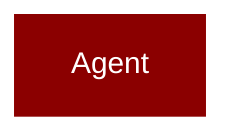

# image_agent

<Badge color="blue">Core SDK</Badge>

## Overview



ImageAgent - A specialized agent class for generating images using AI models.
This class extends the base Agent class to provide specific functionality for image generation,
including support for different image models, sizes, and quality settings.

## Import

```python
from praisonaiagents import image_agent
```

## Classes

<AccordionGroup>
### ImageGenerationConfig

*Extends: BaseModel*

Configuration for image generation settings.

<Expandable title="Properties">

<ResponseField name="style" type="str">
</ResponseField>
<ResponseField name="response_format" type="str">
</ResponseField>
<ResponseField name="timeout" type="int">
</ResponseField>
<ResponseField name="api_base" type="Optional">
</ResponseField>
<ResponseField name="api_key" type="Optional">
</ResponseField>
<ResponseField name="api_version" type="Optional">
</ResponseField>

</Expandable>

### ImageAgent

*Extends: Agent*

A specialized agent for generating images using AI models.

This agent extends the base Agent class with specific functionality for image generation,
including support for different models, sizes, and quality settings.

<Expandable title="Constructor Parameters">

<ParamField query="name" type="Optional">
   (default: `None`)
</ParamField>
<ParamField query="role" type="Optional">
   (default: `None`)
</ParamField>
<ParamField query="goal" type="Optional">
   (default: `None`)
</ParamField>
<ParamField query="backstory" type="Optional">
   (default: `None`)
</ParamField>
<ParamField query="instructions" type="Optional">
   (default: `None`)
</ParamField>
<ParamField query="llm" type="Optional">
   (default: `None`)
</ParamField>
<ParamField query="style" type="str">
   (default: `'natural'`)
</ParamField>
<ParamField query="response_format" type="str">
   (default: `'url'`)
</ParamField>
<ParamField query="timeout" type="int">
   (default: `600`)
</ParamField>
<ParamField query="api_base" type="Optional">
   (default: `None`)
</ParamField>
<ParamField query="api_key" type="Optional">
   (default: `None`)
</ParamField>
<ParamField query="api_version" type="Optional">
   (default: `None`)
</ParamField>
<ParamField query="verbose" type="Union">
   (default: `True`)
</ParamField>

</Expandable>

<AccordionGroup>
<Accordion title="litellm() -> Any">
  Lazy load litellm module when needed.
</Accordion>
<Accordion title="generate_image(prompt: str) -> Dict">
  Generate an image based on the provided prompt.
</Accordion>
<Accordion title="async agenerate_image(prompt: str) -> Dict">
  Async wrapper for generate_image.
</Accordion>
<Accordion title="generate(prompt: str) -> Dict">
  Alias for generate_image() - for consistency with VideoAgent/AudioAgent.
</Accordion>
<Accordion title="async agenerate(prompt: str) -> Dict">
  Async alias for generate_image().
</Accordion>
<Accordion title="chat(prompt: str) -> Dict">
  Generate an image from the prompt.
</Accordion>
<Accordion title="async achat(prompt: str, temperature: float, tools: Optional) -> Union">
  Async chat method for image generation.
</Accordion>
<Accordion title="edit(image: str, prompt: str, mask: Optional) -> Dict">
  Edit an existing image with a prompt.

Args:
    image: Path or URL to the image to edit
    prompt: Description of the desired edits
    mask: Optional mask image (transparent areas will be edited)
    n: Number of images to generate
    size: Output image size
    **kwargs: Additional provider-specific parameters
    
Returns:
    ImageResponse with edited image(s)
    
Example:
    ```python
    agent = ImageAgent(llm="openai/dall-e-2")
    result = agent.edit("photo.png", "Add a sunset in the background")
    ```
</Accordion>
<Accordion title="async aedit(image: str, prompt: str, mask: Optional) -> Dict">
  Async version of edit().
</Accordion>
<Accordion title="variation(image: str, n: int, size: Optional) -> Dict">
  Generate variations of an existing image.

Args:
    image: Path or URL to the source image
    n: Number of variations to generate
    size: Output image size
    **kwargs: Additional provider-specific parameters
    
Returns:
    ImageResponse with image variations
    
Example:
    ```python
    agent = ImageAgent(llm="openai/dall-e-2")
    result = agent.variation("original.png", n=3)
    ```
</Accordion>
<Accordion title="async avariation(image: str, n: int, size: Optional) -> Dict">
  Async version of variation().
</Accordion>
</AccordionGroup>

</AccordionGroup>
