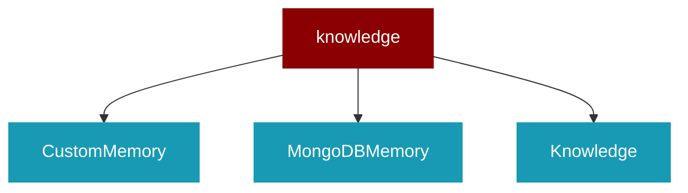

# knowledge

<Badge color="blue">Core SDK</Badge>

## Overview



## Import

```python
from praisonaiagents import knowledge
```

## Classes

<AccordionGroup>
### CustomMemory

### MongoDBMemory

MongoDB-based memory store for knowledge management.

<Expandable title="Constructor Parameters">

<ParamField query="config" type="Any">
   (Required)
</ParamField>

</Expandable>

<AccordionGroup>
<Accordion title="add(messages: Any, user_id: Any, agent_id: Any, run_id: Any, metadata: Any) -> Any">
  Add memory to MongoDB.
</Accordion>
<Accordion title="search(query: Any, user_id: Any, agent_id: Any, run_id: Any, rerank: Any) -> Any">
  Search memories in MongoDB.
</Accordion>
<Accordion title="get_all(user_id: Any, agent_id: Any, run_id: Any) -> Any">
  Get all memories from MongoDB.
</Accordion>
<Accordion title="get(memory_id: Any) -> Any">
  Get a specific memory by ID.
</Accordion>
<Accordion title="update(memory_id: Any, data: Any) -> Any">
  Update a memory.
</Accordion>
<Accordion title="delete(memory_id: Any) -> Any">
  Delete a memory.
</Accordion>
<Accordion title="delete_all(user_id: Any, agent_id: Any, run_id: Any) -> Any">
  Delete all memories.
</Accordion>
<Accordion title="reset() -> Any">
  Reset all memories.
</Accordion>
</AccordionGroup>

### Knowledge

<Expandable title="Constructor Parameters">

<ParamField query="config" type="Any">
   (default: `None`)
</ParamField>
<ParamField query="verbose" type="Any">
   (default: `None`)
</ParamField>

</Expandable>

<AccordionGroup>
<Accordion title="config() -> Any">
</Accordion>
<Accordion title="memory() -> Any">
</Accordion>
<Accordion title="markdown() -> Any">
</Accordion>
<Accordion title="chunker() -> Any">
</Accordion>
<Accordion title="store(content: Any, user_id: Any, agent_id: Any, run_id: Any, metadata: Any) -> Any">
  Store a memory.
</Accordion>
<Accordion title="get_all(user_id: Any, agent_id: Any, run_id: Any) -> Any">
  Retrieve all memories.
</Accordion>
<Accordion title="get(memory_id: Any) -> Any">
  Retrieve a specific memory by ID.
</Accordion>
<Accordion title="search(query: Any, user_id: Any, agent_id: Any, run_id: Any, rerank: Any) -> Any">
  Search for memories related to a query.

Args:
    query: The search query string
    user_id: Optional user ID for user-specific search
    agent_id: Optional agent ID for agent-specific search  
    run_id: Optional run ID for run-specific search
    rerank: Whether to use Mem0's advanced reranking. If None, uses config default
    **kwargs: Additional search parameters to pass to Mem0 (keyword_search, filter_memories, etc.)

Returns:
    List of search results, reranked if rerank=True
</Accordion>
<Accordion title="update(memory_id: Any, data: Any) -> Any">
  Update a memory.
</Accordion>
<Accordion title="history(memory_id: Any) -> Any">
  Get the history of changes for a memory.
</Accordion>
<Accordion title="delete(memory_id: Any) -> Any">
  Delete a memory.
</Accordion>
<Accordion title="delete_all(user_id: Any, agent_id: Any, run_id: Any) -> Any">
  Delete all memories.
</Accordion>
<Accordion title="reset() -> Any">
  Reset all memories.
</Accordion>
<Accordion title="normalize_content(content: Any) -> Any">
  Normalize content for consistent storage.
</Accordion>
<Accordion title="add(file_path: Any, user_id: Any, agent_id: Any, run_id: Any, metadata: Any) -> Any">
  Read file content and store it in memory.

Args:
    file_path: Can be:
        - A string path to local file
        - A URL string
        - A list containing file paths and/or URLs
</Accordion>
<Accordion title="index(path: str, incremental: bool, force: bool, include_glob: list, exclude_glob: list, user_id: str, agent_id: str, run_id: str) -> Any">
  Index a directory or file for knowledge retrieval.

Supports incremental indexing - only changed files are re-indexed.

Args:
    path: Directory or file path to index
    incremental: If True, only index changed files (default: True)
    force: If True, re-index all files regardless of changes
    include_glob: List of glob patterns to include (e.g., ["*.py", "*.md"])
    exclude_glob: List of glob patterns to exclude (e.g., ["*.log", "test_*"])
    user_id: Optional user ID for scoping
    agent_id: Optional agent ID for scoping
    run_id: Optional run ID for scoping
    
Returns:
    IndexResult with indexing statistics
</Accordion>
<Accordion title="get_corpus_stats() -> Any">
  Get statistics about the indexed corpus.

Returns:
    CorpusStats with file count, chunk count, and strategy recommendation
</Accordion>
</AccordionGroup>

</AccordionGroup>
