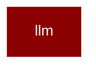

# llm

<Badge color="blue">Core SDK</Badge>

## Overview



LLM Module for PraisonAI Agents.

This module provides language model integrations with lazy loading
to minimize import time when LLM functionality is not immediately needed.

## Import

```python
from praisonaiagents import llm
```
