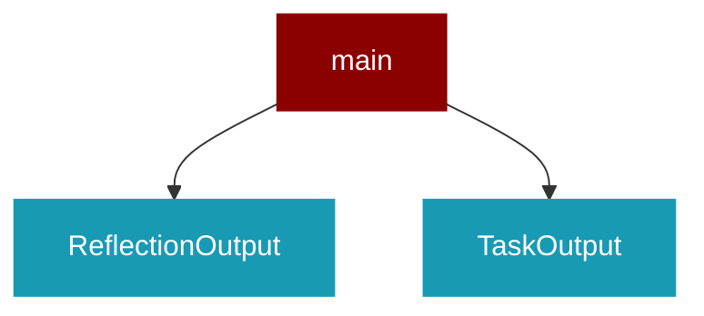

# main

<Badge color="blue">Core SDK</Badge>

## Overview



## Import

```python
from praisonaiagents import main
```

## Classes

<AccordionGroup>
### ReflectionOutput

*Extends: BaseModel*

<Expandable title="Properties">

<ResponseField name="reflection" type="str">
</ResponseField>
<ResponseField name="satisfactory" type="Literal">
</ResponseField>

</Expandable>

### TaskOutput

*Extends: BaseModel*

<Expandable title="Properties">

<ResponseField name="description" type="str">
</ResponseField>
<ResponseField name="summary" type="Optional">
</ResponseField>
<ResponseField name="raw" type="str">
</ResponseField>
<ResponseField name="pydantic" type="Optional">
</ResponseField>
<ResponseField name="json_dict" type="Optional">
</ResponseField>
<ResponseField name="agent" type="str">
</ResponseField>
<ResponseField name="output_format" type="Literal">
</ResponseField>
<ResponseField name="token_metrics" type="Optional">
</ResponseField>

</Expandable>

<AccordionGroup>
<Accordion title="json() -> Optional">
</Accordion>
<Accordion title="to_dict() -> dict">
</Accordion>
</AccordionGroup>

</AccordionGroup>

## Functions

<AccordionGroup>
### register_display_callback()

Register a synchronous or asynchronous callback function for a specific display type.

Args:
    display_type (str): Type of display event ('interaction', 'self_reflection', etc.)
    callback_fn: The callback function to register
    is_async (bool): Whether the callback is asynchronous

```python
def register_display_callback(display_type: str, callback_fn: Any, is_async: bool) -> Any
```

<Expandable title="Parameters">

<ParamField query="display_type" type="str">
</ParamField>
<ParamField query="callback_fn" type="Any">
</ParamField>
<ParamField query="is_async" type="bool">
</ParamField>

</Expandable>

### register_approval_callback()

Register a global approval callback function for dangerous tool operations.

Args:
    callback_fn: Function that takes (function_name, arguments, risk_level) and returns ApprovalDecision

```python
def register_approval_callback(callback_fn: Any) -> Any
```

<Expandable title="Parameters">

<ParamField query="callback_fn" type="Any">
</ParamField>

</Expandable>

### execute_sync_callback()

Execute synchronous callback for a given display type without displaying anything.

This function is used to trigger callbacks even when verbose=False.

Args:
    display_type (str): Type of display event
    **kwargs: Arguments to pass to the callback function

```python
def execute_sync_callback(display_type: str) -> Any
```

<Expandable title="Parameters">

<ParamField query="display_type" type="str">
</ParamField>

</Expandable>

### execute_callback()

Execute both sync and async callbacks for a given display type.

Args:
    display_type (str): Type of display event
    **kwargs: Arguments to pass to the callback functions

```python
async def execute_callback(display_type: str) -> Any
```

<Expandable title="Parameters">

<ParamField query="display_type" type="str">
</ParamField>

</Expandable>

### display_interaction()

Synchronous version of display_interaction.

Displays the task/message and response in clean panels with semantic colors
and optional metrics footer. Uses PraisonAI's unique color palette.

Args:
    metrics: Optional dict with token_in, token_out, cost, model for footer display

```python
def display_interaction(message: Any, response: Any, markdown: Any, generation_time: Any, console: Any, agent_name: Any, agent_role: Any, agent_tools: Any, task_name: Any, task_description: Any, task_id: Any, metrics: Any) -> Any
```

<Expandable title="Parameters">

<ParamField query="message" type="Any">
</ParamField>
<ParamField query="response" type="Any">
</ParamField>
<ParamField query="markdown" type="Any">
</ParamField>
<ParamField query="generation_time" type="Any">
</ParamField>
<ParamField query="console" type="Any">
</ParamField>
<ParamField query="agent_name" type="Any">
</ParamField>
<ParamField query="agent_role" type="Any">
</ParamField>
<ParamField query="agent_tools" type="Any">
</ParamField>
<ParamField query="task_name" type="Any">
</ParamField>
<ParamField query="task_description" type="Any">
</ParamField>
<ParamField query="task_id" type="Any">
</ParamField>
<ParamField query="metrics" type="Any">
</ParamField>

</Expandable>

### display_self_reflection()

```python
def display_self_reflection(message: str, console: Any) -> Any
```

<Expandable title="Parameters">

<ParamField query="message" type="str">
</ParamField>
<ParamField query="console" type="Any">
</ParamField>

</Expandable>

### display_instruction()

```python
def display_instruction(message: str, console: Any, agent_name: str, agent_role: str, agent_tools: List) -> Any
```

<Expandable title="Parameters">

<ParamField query="message" type="str">
</ParamField>
<ParamField query="console" type="Any">
</ParamField>
<ParamField query="agent_name" type="str">
</ParamField>
<ParamField query="agent_role" type="str">
</ParamField>
<ParamField query="agent_tools" type="List">
</ParamField>

</Expandable>

### display_tool_call()

Display tool call information in PraisonAI's unique timeline format.

Uses ▸ prefix, inline timing [X.Xs], and status icons ✓/✗ for a clean,
scannable tool activity display.

Args:
    message: The tool call message (legacy format)
    console: Rich console for output
    tool_name: Name of the tool being called
    tool_input: Input arguments to the tool
    tool_output: Output from the tool (if available)
    elapsed_time: Time taken for tool execution in seconds
    success: Whether the tool call succeeded

```python
def display_tool_call(message: str, console: Any, tool_name: str, tool_input: dict, tool_output: str, elapsed_time: float, success: bool) -> Any
```

<Expandable title="Parameters">

<ParamField query="message" type="str">
</ParamField>
<ParamField query="console" type="Any">
</ParamField>
<ParamField query="tool_name" type="str">
</ParamField>
<ParamField query="tool_input" type="dict">
</ParamField>
<ParamField query="tool_output" type="str">
</ParamField>
<ParamField query="elapsed_time" type="float">
</ParamField>
<ParamField query="success" type="bool">
</ParamField>

</Expandable>

### display_error()

```python
def display_error(message: str, console: Any) -> Any
```

<Expandable title="Parameters">

<ParamField query="message" type="str">
</ParamField>
<ParamField query="console" type="Any">
</ParamField>

</Expandable>

### display_generating()

```python
def display_generating(content: str, start_time: Optional) -> Any
```

<Expandable title="Parameters">

<ParamField query="content" type="str">
</ParamField>
<ParamField query="start_time" type="Optional">
</ParamField>

</Expandable>

### display_reasoning_steps()

Display reasoning steps with unique numbered circles.

Uses ①②③ numbered circles for a distinctive, scannable format
that shows the agent's thought process.

Args:
    steps: List of reasoning step descriptions
    console: Rich console for output

```python
def display_reasoning_steps(steps: List) -> Any
```

<Expandable title="Parameters">

<ParamField query="steps" type="List">
</ParamField>
<ParamField query="console" type="Any">
</ParamField>

</Expandable>

### display_working_status()

Display animated working status with pulsing dots.

Shows a unique "Working ●○○" indicator with phase-specific status.
This is PraisonAI's distinctive approach to showing processing status.

Args:
    phase: Current animation phase (0-3)
    status_text: Optional status description
    console: Rich console for output

Returns:
    Panel object for use with Rich.Live

```python
def display_working_status(phase: int, status_text: str, console: Any) -> Any
```

<Expandable title="Parameters">

<ParamField query="phase" type="int">
</ParamField>
<ParamField query="status_text" type="str">
</ParamField>
<ParamField query="console" type="Any">
</ParamField>

</Expandable>

### adisplay_interaction()

Async version of display_interaction.

```python
async def adisplay_interaction(message: Any, response: Any, markdown: Any, generation_time: Any, console: Any, agent_name: Any, agent_role: Any, agent_tools: Any, task_name: Any, task_description: Any, task_id: Any) -> Any
```

<Expandable title="Parameters">

<ParamField query="message" type="Any">
</ParamField>
<ParamField query="response" type="Any">
</ParamField>
<ParamField query="markdown" type="Any">
</ParamField>
<ParamField query="generation_time" type="Any">
</ParamField>
<ParamField query="console" type="Any">
</ParamField>
<ParamField query="agent_name" type="Any">
</ParamField>
<ParamField query="agent_role" type="Any">
</ParamField>
<ParamField query="agent_tools" type="Any">
</ParamField>
<ParamField query="task_name" type="Any">
</ParamField>
<ParamField query="task_description" type="Any">
</ParamField>
<ParamField query="task_id" type="Any">
</ParamField>

</Expandable>

### adisplay_self_reflection()

Async version of display_self_reflection.

```python
async def adisplay_self_reflection(message: str, console: Any) -> Any
```

<Expandable title="Parameters">

<ParamField query="message" type="str">
</ParamField>
<ParamField query="console" type="Any">
</ParamField>

</Expandable>

### adisplay_instruction()

Async version of display_instruction.

```python
async def adisplay_instruction(message: str, console: Any, agent_name: str, agent_role: str, agent_tools: List) -> Any
```

<Expandable title="Parameters">

<ParamField query="message" type="str">
</ParamField>
<ParamField query="console" type="Any">
</ParamField>
<ParamField query="agent_name" type="str">
</ParamField>
<ParamField query="agent_role" type="str">
</ParamField>
<ParamField query="agent_tools" type="List">
</ParamField>

</Expandable>

### adisplay_tool_call()

Async version of display_tool_call.

```python
async def adisplay_tool_call(message: str, console: Any) -> Any
```

<Expandable title="Parameters">

<ParamField query="message" type="str">
</ParamField>
<ParamField query="console" type="Any">
</ParamField>

</Expandable>

### adisplay_error()

Async version of display_error.

```python
async def adisplay_error(message: str, console: Any) -> Any
```

<Expandable title="Parameters">

<ParamField query="message" type="str">
</ParamField>
<ParamField query="console" type="Any">
</ParamField>

</Expandable>

### adisplay_generating()

Async version of display_generating.

```python
async def adisplay_generating(content: str, start_time: Optional) -> Any
```

<Expandable title="Parameters">

<ParamField query="content" type="str">
</ParamField>
<ParamField query="start_time" type="Optional">
</ParamField>

</Expandable>

### clean_triple_backticks()

Remove triple backticks and surrounding json fences from a string.

```python
def clean_triple_backticks(text: str) -> str
```

<Expandable title="Parameters">

<ParamField query="text" type="str">
</ParamField>

</Expandable>

</AccordionGroup>
