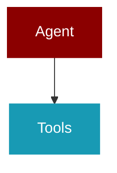

# manager

<Badge color="blue">Core SDK</Badge>

## Overview



Context Manager Facade for PraisonAI Agents.

Provides a unified interface for context management:
- Budgeting and allocation
- Token estimation with validation
- Composition within limits
- Optimization with benefit checking
- Monitoring with snapshot hooks
- Multi-agent orchestration support
- Optimization history tracking

This is the main entry point for context management in both SDK and CLI.

## Import

```python
from praisonaiagents import manager
```

## Classes

### SessionDeduplicationCache

Thread-safe session-level content deduplication cache.

Tracks content hashes across all agents in a workflow session
to prevent duplicate content from being sent to LLM.

<Expandable title="Constructor Parameters">

<ParamField query="max_size" type="int">
   (default: `1000`)
</ParamField>

</Expandable>

#### Methods

##### check_and_add(content_hash: str, agent_name: str, tokens: int) -> bool

Check if content hash exists and add if new.

Args:
    content_hash: Hash of the content
    agent_name: Name of the agent adding this content
    tokens: Estimated tokens in this content
    
Returns:
    True if duplicate (already exists), False if new

---
##### get_stats() -> Dict

Get deduplication statistics.

---
##### clear() -> None

Clear the cache.

---

### EstimationMode

*Extends: str, Enum*

Token estimation modes.

### ContextShareMode

*Extends: str, Enum*

How context is shared between agents.

### ToolShareMode

*Extends: str, Enum*

How tools are shared between agents.

### OptimizationEventType

*Extends: str, Enum*

Types of optimization events.

### ContextPolicy

Policy for context sharing during agent handoffs.

Controls how context is passed between agents in multi-agent scenarios.

<Expandable title="Properties">

<ResponseField name="share" type="bool">
</ResponseField>
<ResponseField name="share_mode" type="ContextShareMode">
</ResponseField>
<ResponseField name="max_tokens" type="int">
</ResponseField>
<ResponseField name="tools_share" type="ToolShareMode">
</ResponseField>
<ResponseField name="preserve_system" type="bool">
</ResponseField>
<ResponseField name="preserve_recent_turns" type="int">
</ResponseField>

</Expandable>

#### Methods

##### to_dict() -> Dict
---

### OptimizationEvent

Record of an optimization event.

<Expandable title="Properties">

<ResponseField name="timestamp" type="str">
</ResponseField>
<ResponseField name="event_type" type="OptimizationEventType">
</ResponseField>
<ResponseField name="strategy" type="Optional">
</ResponseField>
<ResponseField name="tokens_before" type="int">
</ResponseField>
<ResponseField name="tokens_after" type="int">
</ResponseField>
<ResponseField name="tokens_saved" type="int">
</ResponseField>
<ResponseField name="messages_affected" type="int">
</ResponseField>
<ResponseField name="details" type="Dict">
</ResponseField>

</Expandable>

#### Methods

##### to_dict() -> Dict
---

### EstimationMetrics

Metrics for token estimation accuracy.

<Expandable title="Properties">

<ResponseField name="heuristic_estimate" type="int">
</ResponseField>
<ResponseField name="accurate_estimate" type="int">
</ResponseField>
<ResponseField name="error_pct" type="float">
</ResponseField>
<ResponseField name="estimator_used" type="EstimationMode">
</ResponseField>

</Expandable>

#### Methods

##### to_dict() -> Dict
---

### PerToolBudget

Per-tool token budget configuration.

<Expandable title="Properties">

<ResponseField name="tool_name" type="str">
</ResponseField>
<ResponseField name="max_output_tokens" type="int">
</ResponseField>
<ResponseField name="protected" type="bool">
</ResponseField>

</Expandable>

#### Methods

##### to_dict() -> Dict
---

### SnapshotHookData

Data captured at LLM call boundary for exact snapshot.

<Expandable title="Properties">

<ResponseField name="timestamp" type="str">
</ResponseField>
<ResponseField name="messages" type="List">
</ResponseField>
<ResponseField name="tools" type="List">
</ResponseField>
<ResponseField name="message_hash" type="str">
</ResponseField>
<ResponseField name="tools_hash" type="str">
</ResponseField>
<ResponseField name="ledger" type="Optional">
</ResponseField>
<ResponseField name="budget" type="Optional">
</ResponseField>

</Expandable>

#### Methods

##### to_dict() -> Dict
---

### ManagerConfig

Complete configuration for ContextManager.

Consolidates all context management settings with proper precedence.

<Expandable title="Properties">

<ResponseField name="auto_compact" type="bool">
</ResponseField>
<ResponseField name="compact_threshold" type="float">
</ResponseField>
<ResponseField name="strategy" type="OptimizerStrategy">
</ResponseField>
<ResponseField name="compression_min_gain_pct" type="float">
</ResponseField>
<ResponseField name="compression_max_attempts" type="int">
</ResponseField>
<ResponseField name="output_reserve" type="int">
</ResponseField>
<ResponseField name="history_ratio" type="float">
</ResponseField>
<ResponseField name="default_tool_output_max" type="int">
</ResponseField>
<ResponseField name="tool_budgets" type="Dict">
</ResponseField>
<ResponseField name="protected_tools" type="List">
</ResponseField>
<ResponseField name="llm_summarize" type="bool">
</ResponseField>
<ResponseField name="smart_tool_summarize" type="bool">
</ResponseField>
<ResponseField name="tool_summarize_limits" type="Dict">
</ResponseField>
<ResponseField name="estimation_mode" type="EstimationMode">
</ResponseField>
<ResponseField name="log_estimation_mismatch" type="bool">
</ResponseField>
<ResponseField name="mismatch_threshold_pct" type="float">
</ResponseField>
<ResponseField name="monitor_enabled" type="bool">
</ResponseField>
<ResponseField name="monitor_path" type="str">
</ResponseField>
<ResponseField name="monitor_format" type="Literal">
</ResponseField>
<ResponseField name="monitor_frequency" type="Literal">
</ResponseField>
<ResponseField name="monitor_write_mode" type="Literal">
</ResponseField>
<ResponseField name="redact_sensitive" type="bool">
</ResponseField>
<ResponseField name="snapshot_timing" type="Literal">
</ResponseField>
<ResponseField name="allow_absolute_paths" type="bool">
</ResponseField>
<ResponseField name="prune_after_tokens" type="int">
</ResponseField>
<ResponseField name="keep_recent_turns" type="int">
</ResponseField>
<ResponseField name="source" type="str">
</ResponseField>

</Expandable>

#### Methods

##### to_dict() -> Dict
---
##### merge() -> ManagerConfig

Create new config with overrides applied.

---

### ContextManager

Unified facade for context management.

Orchestrates budgeting, composition, optimization, and monitoring.
Provides hooks for exact LLM boundary snapshots.
Tracks optimization history for debugging.

Example:
    manager = ContextManager(model="gpt-4o")
    
    # Process messages before LLM call
    result = manager.process(
        messages=messages,
        system_prompt=system_prompt,
        tools=tools,
    )
    
    # Get optimized messages
    optimized_messages = result["messages"]
    
    # Check if optimization occurred
    if result["optimized"]:
        print(f"Saved &#123;result['tokens_saved']&#125; tokens")

<Expandable title="Constructor Parameters">

<ParamField query="model" type="str">
   (default: `'gpt-4o-mini'`)
</ParamField>
<ParamField query="config" type="Optional">
   (default: `None`)
</ParamField>
<ParamField query="session_id" type="str">
   (default: `''`)
</ParamField>
<ParamField query="agent_name" type="str">
   (default: `''`)
</ParamField>
<ParamField query="session_cache" type="Optional">
   (default: `None`)
</ParamField>
<ParamField query="llm_summarize_fn" type="Optional">
   (default: `None`)
</ParamField>

</Expandable>

#### Methods

##### process(messages: List) -> Dict

Process messages through the context pipeline.

Applies budgeting, optimization, and monitoring.

Args:
    messages: Conversation messages
    system_prompt: System prompt content
    tools: Tool schemas
    trigger: What triggered this processing
    
Returns:
    Dict with processed messages and metadata

---
##### capture_llm_boundary(messages: List) -> SnapshotHookData

Capture exact state at LLM call boundary.

Call this immediately before sending to LLM to get exact snapshot.

Args:
    messages: Exact messages being sent
    tools: Exact tool schemas being sent
    
Returns:
    SnapshotHookData with hashes for verification

---
##### register_snapshot_callback(callback: Callable) -> None

Register a callback for LLM boundary snapshots.

---
##### get_last_snapshot_hook() -> Optional

Get the last LLM boundary snapshot.

---
##### estimate_tokens(text: str, validate: bool) -> Tuple

Estimate tokens with optional validation.

Args:
    text: Text to estimate
    validate: Whether to validate against accurate count
    
Returns:
    Tuple of (token_count, metrics)

---
##### get_tool_budget(tool_name: str) -> int

Get token budget for a specific tool.

---
##### set_tool_budget(tool_name: str, max_tokens: int, protected: bool) -> None

Set token budget for a specific tool.

---
##### truncate_tool_output(tool_name: str, output: str) -> str

Truncate tool output according to its budget.

---
##### get_history() -> List

Get optimization history.

---
##### get_stats() -> Dict

Get current context statistics.

---
##### emergency_truncate(messages: List) -> List

Emergency truncation when optimization isn't enough.

Aggressively removes messages to fit within target tokens.
Preserves system messages and most recent turns.

Args:
    messages: Messages to truncate
    target_tokens: Target token count
    
Returns:
    Truncated messages list

---
##### get_resolved_config() -> Dict

Get the fully resolved configuration with source info.

---
##### reset() -> None

Reset manager state.

---

### MultiAgentContextManager

Context manager for multi-agent orchestration.

Provides per-agent isolation with controlled sharing policies.

<Expandable title="Constructor Parameters">

<ParamField query="config" type="Optional">
   (default: `None`)
</ParamField>
<ParamField query="default_policy" type="Optional">
   (default: `None`)
</ParamField>
<ParamField query="session_cache" type="Optional">
   (default: `None`)
</ParamField>

</Expandable>

#### Methods

##### get_agent_manager(agent_id: str, model: str) -> ContextManager

Get or create context manager for an agent.

---
##### get_session_cache() -> SessionDeduplicationCache

Get the session deduplication cache.

---
##### set_agent_policy(agent_id: str, policy: ContextPolicy) -> None

Set context policy for an agent.

---
##### get_agent_policy(agent_id: str) -> ContextPolicy

Get context policy for an agent.

---
##### prepare_handoff(from_agent: str, to_agent: str, messages: List) -> List

Prepare context for handoff between agents.

Args:
    from_agent: Source agent ID
    to_agent: Target agent ID
    messages: Current messages
    policy: Override policy for this handoff
    
Returns:
    Messages to pass to target agent

---
##### get_combined_stats() -> Dict

Get combined statistics across all agents.

---


## Functions

### deduplicate_topics()

Programmatic deduplication of topics/items before agent processing.

This helps prevent duplicate content from being passed to downstream agents,
reducing token waste and improving quality.

Args:
    topics: List of topic dicts or strings
    key: Key to use for comparison if topics are dicts (default: "title")
    similarity_threshold: Similarity threshold for fuzzy matching (0.0-1.0)
    
Returns:
    Deduplicated list of topics

```python
def deduplicate_topics(topics: list, key: str, similarity_threshold: float) -> list
```

<Expandable title="Parameters">

<ParamField query="topics" type="list">
</ParamField>
<ParamField query="key" type="str">
</ParamField>
<ParamField query="similarity_threshold" type="float">
</ParamField>

</Expandable>

### create_context_manager()

Create a context manager with proper config precedence.

Precedence: CLI &gt; ENV &gt; config_file &gt; defaults

Args:
    model: Model name
    session_id: Session ID
    agent_name: Agent name
    config_file: Path to config.yaml
    cli_overrides: CLI argument overrides
    
Returns:
    Configured ContextManager

```python
def create_context_manager(model: str, session_id: str, agent_name: str, config_file: Optional) -> ContextManager
```

<Expandable title="Parameters">

<ParamField query="model" type="str">
</ParamField>
<ParamField query="session_id" type="str">
</ParamField>
<ParamField query="agent_name" type="str">
</ParamField>
<ParamField query="config_file" type="Optional">
</ParamField>
<ParamField query="cli_overrides" type="Optional">
</ParamField>

</Expandable>

