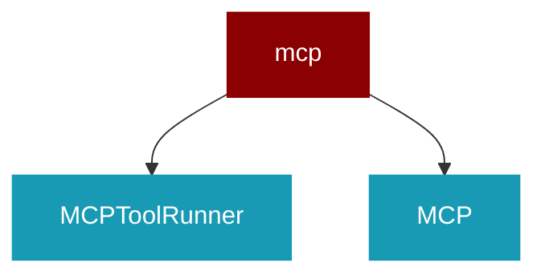

# mcp

<Badge color="blue">Core SDK</Badge>

## Overview



## Import

```python
from praisonaiagents import mcp
```

## Classes

<AccordionGroup>
### MCPToolRunner

*Extends: threading.Thread*

A dedicated thread for running MCP operations.

<Expandable title="Constructor Parameters">

<ParamField query="server_params" type="Any">
   (Required)
</ParamField>
<ParamField query="timeout" type="Any">
   (default: `60`)
</ParamField>

</Expandable>

<AccordionGroup>
<Accordion title="run() -> Any">
  Main thread function that processes MCP requests.
</Accordion>
<Accordion title="call_tool(tool_name: Any, arguments: Any) -> Any">
  Call an MCP tool and wait for the result.
</Accordion>
<Accordion title="shutdown() -> Any">
  Signal the thread to shut down.
</Accordion>
</AccordionGroup>

### MCP

Model Context Protocol (MCP) integration for PraisonAI Agents.

This class provides a simple way to connect to MCP servers and use their tools
within PraisonAI agents.

Example:
    ```python
    from praisonaiagents import Agent
    from praisonaiagents.mcp import MCP
    
    # Method 1: Using command and args separately
    agent = Agent(
        instructions="You are a helpful assistant...",
        llm="gpt-4o-mini",
        tools=MCP(
            command="/path/to/python",
            args=["/path/to/app.py"]
        )
    )
    
    # Method 2: Using a single command string
    agent = Agent(
        instructions="You are a helpful assistant...",
        llm="gpt-4o-mini",
        tools=MCP("/path/to/python /path/to/app.py")
    )
    
    # Method 3: Using an SSE endpoint
    agent = Agent(
        instructions="You are a helpful assistant...",
        llm="gpt-4o-mini",
        tools=MCP("http://localhost:8080/sse")
    )
    
    agent.start("What is the stock price of Tesla?")
    ```

<Expandable title="Constructor Parameters">

<ParamField query="command_or_string" type="Any">
   (default: `None`)
</ParamField>
<ParamField query="args" type="Any">
   (default: `None`)
</ParamField>

</Expandable>

<AccordionGroup>
<Accordion title="get_tools() -> List">
  Get the list of tool functions from this MCP instance.

This method provides explicit access to the tools list, which is useful
when you need to inspect or manipulate the tools programmatically.

Returns:
    List[Callable]: List of tool functions that can be called
    
Example:
    ```python
    mcp = MCP("npx -y @modelcontextprotocol/server-time")
    tools = mcp.get_tools()
    for tool in tools:
        print(f"Tool: {tool.__name__}")
    ```
</Accordion>
<Accordion title="to_openai_tool() -> Any">
  Convert the MCP tool to an OpenAI-compatible tool definition.

This method is specifically invoked by the Agent class when using
provider/model format (e.g., "openai/gpt-4o-mini").

Returns:
    dict or list: OpenAI-compatible tool definition(s)
</Accordion>
<Accordion title="shutdown() -> Any">
  Explicitly shut down MCP resources.

Call this method when done using the MCP instance to ensure
all background threads and connections are properly cleaned up.
</Accordion>
</AccordionGroup>

</AccordionGroup>
