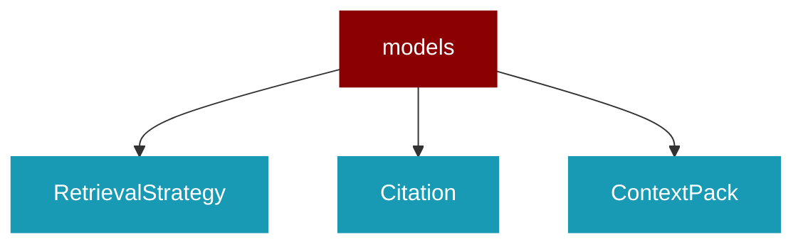

# models

<Badge color="blue">Core SDK</Badge>

## Overview



RAG Data Models for PraisonAI Agents.

Lightweight dataclasses for RAG results and configuration.
No heavy imports - only stdlib and typing.

## Import

```python
from praisonaiagents import models
```

## Classes

<AccordionGroup>
### RetrievalStrategy

*Extends: str, Enum*

Available retrieval strategies for RAG.

### Citation

Source citation for RAG answers.

Attributes:
    id: Unique citation identifier (e.g., "[1]", "[2]")
    source: Source document path or URL
    text: Text snippet from the source
    score: Relevance score (0-1)
    doc_id: Optional document identifier
    chunk_id: Optional chunk identifier within document
    offset: Optional character offset in source
    metadata: Additional metadata

<Expandable title="Properties">

<ResponseField name="id" type="str">
</ResponseField>
<ResponseField name="source" type="str">
</ResponseField>
<ResponseField name="text" type="str">
</ResponseField>
<ResponseField name="score" type="float">
</ResponseField>
<ResponseField name="doc_id" type="Optional">
</ResponseField>
<ResponseField name="chunk_id" type="Optional">
</ResponseField>
<ResponseField name="offset" type="Optional">
</ResponseField>
<ResponseField name="metadata" type="Dict">
</ResponseField>

</Expandable>

<AccordionGroup>
<Accordion title="to_dict() -> Dict">
  Convert to dictionary.
</Accordion>
</AccordionGroup>

### ContextPack

Context pack for orchestrator pattern - retrieval without generation.

Provides deterministic context that can be passed to Agent.chat_with_context().

Attributes:
    context: The formatted context string ready for injection
    citations: List of source citations
    query: The original query
    metadata: Additional metadata (timing, retrieval stats, etc.)

<Expandable title="Properties">

<ResponseField name="context" type="str">
</ResponseField>
<ResponseField name="citations" type="List">
</ResponseField>
<ResponseField name="query" type="str">
</ResponseField>
<ResponseField name="metadata" type="Dict">
</ResponseField>

</Expandable>

<AccordionGroup>
<Accordion title="to_dict() -> Dict">
  Convert to dictionary.
</Accordion>
<Accordion title="has_citations() -> bool">
  Check if context pack has citations.
</Accordion>
<Accordion title="format_for_prompt(include_sources: bool) -> str">
  Format context for injection into a prompt.
</Accordion>
</AccordionGroup>

### RAGResult

Result from a RAG query.

Attributes:
    answer: The generated answer text
    citations: List of source citations
    context_used: The context string passed to the LLM
    query: The original query
    metadata: Additional metadata (timing, model info, etc.)

<Expandable title="Properties">

<ResponseField name="answer" type="str">
</ResponseField>
<ResponseField name="citations" type="List">
</ResponseField>
<ResponseField name="context_used" type="str">
</ResponseField>
<ResponseField name="query" type="str">
</ResponseField>
<ResponseField name="metadata" type="Dict">
</ResponseField>

</Expandable>

<AccordionGroup>
<Accordion title="to_dict() -> Dict">
  Convert to dictionary.
</Accordion>
<Accordion title="has_citations() -> bool">
  Check if result has citations.
</Accordion>
<Accordion title="format_answer_with_citations() -> str">
  Format answer with inline citation references.
</Accordion>
</AccordionGroup>

### RAGConfig

Configuration for RAG pipeline.

Attributes:
    top_k: Number of chunks to retrieve
    min_score: Minimum relevance score threshold
    max_context_tokens: Maximum tokens for context
    include_citations: Whether to include citations in result
    retrieval_strategy: Strategy for retrieval (basic, fusion, hybrid)
    rerank: Whether to rerank results
    rerank_top_k: Number of results after reranking
    template: Prompt template with &#123;context&#125; and &#123;question&#125; placeholders
    system_prompt: Optional system prompt for LLM
    stream: Whether to stream responses

<Expandable title="Properties">

<ResponseField name="top_k" type="int">
</ResponseField>
<ResponseField name="min_score" type="float">
</ResponseField>
<ResponseField name="max_context_tokens" type="int">
</ResponseField>
<ResponseField name="include_citations" type="bool">
</ResponseField>
<ResponseField name="retrieval_strategy" type="RetrievalStrategy">
</ResponseField>
<ResponseField name="rerank" type="bool">
</ResponseField>
<ResponseField name="rerank_top_k" type="int">
</ResponseField>
<ResponseField name="model" type="Optional">
</ResponseField>
<ResponseField name="template" type="str">
</ResponseField>
<ResponseField name="system_prompt" type="Optional">
</ResponseField>
<ResponseField name="stream" type="bool">
</ResponseField>

</Expandable>

<AccordionGroup>
<Accordion title="to_dict() -> Dict">
  Convert to dictionary.
</Accordion>
</AccordionGroup>

</AccordionGroup>
