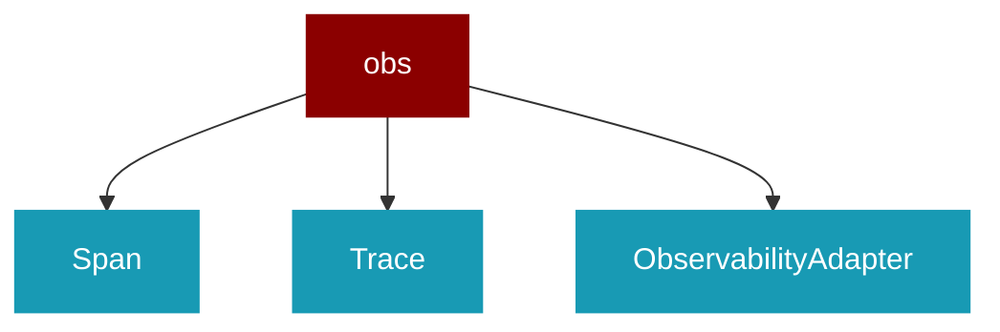

# obs

<Badge color="blue">Core SDK</Badge>

## Overview



Observability interface for PraisonAI Agents.

This module provides the protocol and types for observability/tracing.
Implementations are provided by the wrapper layer (praisonai_tools.observability).

Usage (simplest - recommended):
    from praisonaiagents import Agent, obs
    
    agent = Agent(
        name="Assistant",
        observability=obs.auto(),  # Auto-detect from env vars
    )
    agent.chat("Hello!")  # Auto-traces to configured provider

Alternative (explicit provider):
    observability=obs.langfuse()     # Langfuse
    observability=obs.langsmith()    # LangSmith
    observability=obs.agentops()     # AgentOps
    observability=obs.arize()        # Arize Phoenix
    observability=obs.datadog()      # Datadog

## Import

```python
from praisonaiagents import obs
```

## Classes

### Span

Represents a span in a trace.

<Expandable title="Properties">

<ResponseField name="span_id" type="str">
</ResponseField>
<ResponseField name="trace_id" type="str">
</ResponseField>
<ResponseField name="name" type="str">
</ResponseField>
<ResponseField name="parent_span_id" type="Optional">
</ResponseField>
<ResponseField name="start_time" type="float">
</ResponseField>
<ResponseField name="end_time" type="Optional">
</ResponseField>
<ResponseField name="attributes" type="Dict">
</ResponseField>
<ResponseField name="status" type="str">
</ResponseField>

</Expandable>

### Trace

Represents a complete trace.

<Expandable title="Properties">

<ResponseField name="trace_id" type="str">
</ResponseField>
<ResponseField name="session_id" type="Optional">
</ResponseField>
<ResponseField name="agent_name" type="Optional">
</ResponseField>
<ResponseField name="user_id" type="Optional">
</ResponseField>
<ResponseField name="start_time" type="float">
</ResponseField>
<ResponseField name="end_time" type="Optional">
</ResponseField>
<ResponseField name="spans" type="List">
</ResponseField>
<ResponseField name="metadata" type="Dict">
</ResponseField>
<ResponseField name="status" type="str">
</ResponseField>

</Expandable>

### ObservabilityAdapter

*Extends: Protocol*

Protocol for observability adapters.

#### Methods

##### on_trace_start(trace_id: str, session_id: Optional) -> None

Called when a trace starts.

---
##### on_trace_end(trace_id: str, status: str, metadata: Optional) -> None

Called when a trace ends.

---
##### on_span_start(span_id: str, trace_id: str, name: str, parent_span_id: Optional) -> None

Called when a span starts.

---
##### on_span_end(span_id: str, status: str, attributes: Optional) -> None

Called when a span ends.

---
##### on_llm_call(span_id: str, model: str, messages: List) -> None

Called when an LLM call is made.

---
##### on_tool_call(span_id: str, tool_name: str, args: Dict) -> None

Called when a tool is invoked.

---
##### flush() -> None

Flush any pending data.

---
##### close() -> None

Close the adapter and release resources.

---

