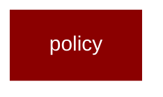

# policy

<Badge color="blue">Core SDK</Badge>

## Overview



Exec Policy Engine for PraisonAI Agents.

Provides policy-based execution control:
- Define rules for what agents can/cannot do
- Tool execution policies
- Resource access control
- Rate limiting and quotas

Zero Performance Impact:
- All imports are lazy loaded via __getattr__
- Policies only evaluated when enabled
- No overhead when no policies defined

Usage:
    from praisonaiagents.policy import PolicyEngine, Policy, PolicyRule
    
    # Create a policy engine
    engine = PolicyEngine()
    
    # Add a policy
    policy = Policy(
        name="no_delete",
        rules=[
            PolicyRule(
                action="deny",
                resource="tool:delete_*",
                reason="Delete operations are not allowed"
            )
        ]
    )
    engine.add_policy(policy)
    
    # Check if action is allowed
    result = engine.check("tool:delete_file", context=&#123;&#125;)

## Import

```python
from praisonaiagents import policy
```
