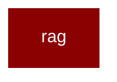

# rag

<Badge color="blue">Core SDK</Badge>

## Overview



PraisonAI RAG - Retrieval Augmented Generation Module.

This module provides a thin orchestration layer over Knowledge for RAG workflows.
Knowledge handles indexing/retrieval; RAG adds answer generation with citations.

Usage:
    from praisonaiagents.rag import RAG, RAGConfig, RAGResult, Citation
    
    # With existing Knowledge
    rag = RAG(knowledge=my_knowledge)
    result = rag.query("What is the main finding?")
    print(result.answer)
    for citation in result.citations:
        print(f"  [&#123;citation.id&#125;] &#123;citation.source&#125;")

All imports are lazy to avoid performance impact when RAG is not used.

## Import

```python
from praisonaiagents import rag
```
