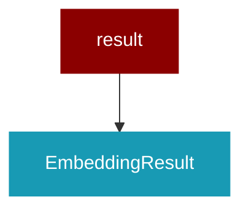

# result

<Badge color="blue">Core SDK</Badge>

## Overview



EmbeddingResult dataclass for embedding responses.

This module provides a structured result type for embedding operations,
matching the OpenAI embedding response format.

## Import

```python
from praisonaiagents import result
```

## Classes

### EmbeddingResult

Result from embedding generation.

Attributes:
    embeddings: List of embedding vectors (each is a list of floats)
    model: The model used for embedding (optional)
    usage: Token usage information (optional)
    metadata: Additional metadata (optional)

Example:
    &gt;&gt;&gt; result = EmbeddingResult(
    ...     embeddings=[[0.1, 0.2, 0.3]],
    ...     model="text-embedding-3-small",
    ...     usage=&#123;"prompt_tokens": 5, "total_tokens": 5&#125;
    ... )
    &gt;&gt;&gt; print(len(result.embeddings[0]))
    3

<Expandable title="Properties">

<ResponseField name="embeddings" type="List">
</ResponseField>
<ResponseField name="model" type="Optional">
</ResponseField>
<ResponseField name="usage" type="Optional">
</ResponseField>
<ResponseField name="metadata" type="Dict">
</ResponseField>

</Expandable>

