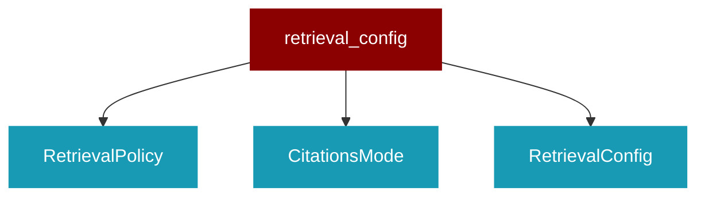

# retrieval_config

<Badge color="blue">Core SDK</Badge>

## Overview



RetrievalConfig - Unified configuration for Agent retrieval behavior.

This is the SINGLE configuration surface for all retrieval settings.
Replaces separate knowledge_config and rag_config parameters.

## Import

```python
from praisonaiagents import retrieval_config
```

## Classes

<AccordionGroup>
### RetrievalPolicy

*Extends: str, Enum*

Policy for when to perform retrieval.

### CitationsMode

*Extends: str, Enum*

How to include citations in responses.

### RetrievalConfig

Unified configuration for Agent retrieval behavior.

This is the SINGLE configuration surface that replaces:
- knowledge_config
- rag_config

Attributes:
    enabled: Whether retrieval is enabled (default: True if knowledge provided)
    policy: When to retrieve (auto, always, never)
    top_k: Number of chunks to retrieve
    min_score: Minimum relevance score threshold (0.0-1.0)
    max_context_tokens: Maximum tokens for retrieved context
    rerank: Whether to rerank results for better relevance
    hybrid: Whether to use hybrid retrieval (dense + keyword)
    citations: Whether to include source citations
    citations_mode: How to include citations (append, inline, hidden)
    
    # Vector store configuration
    vector_store_provider: Vector store provider (chroma, mongodb, etc.)
    vector_store_config: Provider-specific configuration
    collection_name: Collection/index name
    persist_path: Path for persistent storage
    
    # Embedding configuration
    embedder_provider: Embedding provider
    embedder_model: Embedding model name
    
    # Advanced options
    auto_keywords: Keywords that trigger retrieval in auto mode
    auto_min_length: Minimum query length for auto retrieval
    context_template: Template for formatting retrieved context
    system_separation: Whether to use system prompt separation for safety

<Expandable title="Properties">

<ResponseField name="enabled" type="bool">
</ResponseField>
<ResponseField name="policy" type="RetrievalPolicy">
</ResponseField>
<ResponseField name="top_k" type="int">
</ResponseField>
<ResponseField name="min_score" type="float">
</ResponseField>
<ResponseField name="max_context_tokens" type="int">
</ResponseField>
<ResponseField name="rerank" type="bool">
</ResponseField>
<ResponseField name="hybrid" type="bool">
</ResponseField>
<ResponseField name="citations" type="bool">
</ResponseField>
<ResponseField name="citations_mode" type="CitationsMode">
</ResponseField>
<ResponseField name="model_context_window" type="Optional">
</ResponseField>
<ResponseField name="reserved_response_tokens" type="int">
</ResponseField>
<ResponseField name="dynamic_budget" type="bool">
</ResponseField>
<ResponseField name="strategy" type="str">
</ResponseField>
<ResponseField name="compress" type="bool">
</ResponseField>
<ResponseField name="compression_ratio" type="float">
</ResponseField>
<ResponseField name="include_glob" type="Optional">
</ResponseField>
<ResponseField name="exclude_glob" type="Optional">
</ResponseField>
<ResponseField name="path_filter" type="Optional">
</ResponseField>
<ResponseField name="vector_store_provider" type="str">
</ResponseField>
<ResponseField name="vector_store_config" type="Dict">
</ResponseField>
<ResponseField name="collection_name" type="Optional">
</ResponseField>
<ResponseField name="persist_path" type="str">
</ResponseField>
<ResponseField name="embedder_provider" type="Optional">
</ResponseField>
<ResponseField name="embedder_model" type="Optional">
</ResponseField>
<ResponseField name="auto_keywords" type="frozenset">
</ResponseField>
<ResponseField name="auto_min_length" type="int">
</ResponseField>
<ResponseField name="context_template" type="str">
</ResponseField>
<ResponseField name="system_separation" type="bool">
</ResponseField>

</Expandable>

<AccordionGroup>
<Accordion title="get_token_budget(model_name: Optional) -> Any">
  Get TokenBudget instance for this config.

Args:
    model_name: Optional model name for context window detection
    
Returns:
    TokenBudget configured for this retrieval config
</Accordion>
<Accordion title="get_strategy(corpus_stats: Any) -> Any">
  Get retrieval strategy based on config and corpus stats.

Args:
    corpus_stats: Optional CorpusStats for auto-selection
    
Returns:
    RetrievalStrategy enum value
</Accordion>
<Accordion title="to_dict() -> Dict">
  Convert to dictionary.
</Accordion>
<Accordion title="to_knowledge_config() -> Dict">
  Convert to Knowledge-compatible config.
</Accordion>
<Accordion title="to_rag_config() -> Dict">
  Convert to RAG pipeline config.
</Accordion>
<Accordion title="should_retrieve(query: str, force: bool, skip: bool) -> bool">
  Determine if retrieval should be performed for a query.

Args:
    query: The user query
    force: Force retrieval regardless of policy
    skip: Skip retrieval regardless of policy
    
Returns:
    True if retrieval should be performed
</Accordion>
</AccordionGroup>

</AccordionGroup>

## Functions

<AccordionGroup>
### create_retrieval_config()

Create RetrievalConfig from various input formats.

Supports:
- New unified retrieval_config dict
- Legacy knowledge_config + rag_config dicts
- RetrievalConfig instance passthrough

Args:
    knowledge_config: Legacy knowledge configuration
    rag_config: Legacy RAG configuration
    retrieval_config: New unified configuration
    
Returns:
    RetrievalConfig instance or None

```python
def create_retrieval_config(knowledge_config: Optional) -> Optional
```

<Expandable title="Parameters">

<ParamField query="knowledge_config" type="Optional">
</ParamField>
<ParamField query="rag_config" type="Optional">
</ParamField>
<ParamField query="retrieval_config" type="Optional">
</ParamField>

</Expandable>

</AccordionGroup>
