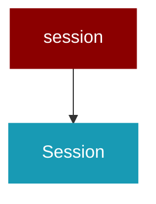

# session

<Badge color="blue">Core SDK</Badge>

## Overview



Session Management for PraisonAI Agents

A simple wrapper around existing stateful capabilities to provide a unified
session API for developers building stateful agent applications.

## Import

```python
from praisonaiagents import session
```

## Classes

### Session

A simple wrapper around PraisonAI's existing stateful capabilities.

Provides a unified API for:
- Session management with persistent state
- Memory operations (short-term, long-term, user-specific)
- Knowledge base operations
- Agent state management
- Remote agent connectivity

Examples:
    # Local session with agent
    session = Session(session_id="chat_123", user_id="user_456")
    agent = session.Agent(name="Assistant", role="Helpful AI")
    
    # Remote agent session (similar to Google ADK)
    session = Session(agent_url="192.168.1.10:8000/agent")
    response = session.chat("Hello from remote client!")
    
    # Save session state
    session.save_state(&#123;"conversation_topic": "AI research"&#125;)

<Expandable title="Constructor Parameters">

<ParamField query="session_id" type="Optional">
   (default: `None`)
</ParamField>
<ParamField query="user_id" type="Optional">
   (default: `None`)
</ParamField>
<ParamField query="agent_url" type="Optional">
   (default: `None`)
</ParamField>
<ParamField query="memory_config" type="Optional">
   (default: `None`)
</ParamField>
<ParamField query="knowledge_config" type="Optional">
   (default: `None`)
</ParamField>
<ParamField query="timeout" type="int">
   (default: `30`)
</ParamField>

</Expandable>

#### Methods

##### memory() -> Memory

Lazy-loaded memory instance

---
##### knowledge() -> Knowledge

Lazy-loaded knowledge instance

---
##### Agent(name: str, role: str, instructions: Optional) -> Agent

Create an agent with session context.

Args:
    name: Agent name
    role: Agent role
    instructions: Agent instructions
    tools: List of tools for the agent
    memory: Enable memory for the agent
    knowledge: Knowledge sources for the agent
    **kwargs: Additional agent parameters

Returns:
    Configured Agent instance
    
Raises:
    ValueError: If this is a remote session (use chat() instead)

---
##### create_agent() -> Agent

Backward compatibility wrapper for Agent method

---
##### save_state(state_data: Dict) -> None

Save session state data to memory.

Args:
    state_data: Dictionary of state data to save
    
Raises:
    ValueError: If this is a remote session

---
##### restore_state() -> Dict

Restore session state from memory.

Returns:
    Dictionary of restored state data
    
Raises:
    ValueError: If this is a remote session

---
##### get_state(key: str, default: Any) -> Any

Get a specific state value

---
##### set_state(key: str, value: Any) -> None

Set a specific state value

---
##### increment_state(key: str, increment: int, default: int) -> None

Increment a numeric state value

---
##### add_memory(text: str, memory_type: str) -> None

Add information to session memory.

Args:
    text: Text to store
    memory_type: "short" or "long" term memory
    **metadata: Additional metadata

---
##### search_memory(query: str, memory_type: str, limit: int) -> List

Search session memory.

Args:
    query: Search query
    memory_type: "short" or "long" term memory
    limit: Maximum results to return

Returns:
    List of memory results

---
##### add_knowledge(source: str) -> None

Add knowledge source to session.

Args:
    source: File path, URL, or text content

---
##### search_knowledge(query: str, limit: int) -> List

Search session knowledge base.

Args:
    query: Search query
    limit: Maximum results to return

Returns:
    List of knowledge results

---
##### clear_memory(memory_type: str) -> None

Clear session memory.

Args:
    memory_type: "short", "long", or "all"

---
##### get_context(query: str, max_items: int) -> str

Build context from session memory and knowledge.

Args:
    query: Query to build context for
    max_items: Maximum items per section

Returns:
    Formatted context string

---
##### chat(message: str) -> str

Send a message to the remote agent or handle local session.

Args:
    message: The message to send to the agent
    **kwargs: Additional parameters for the request
    
Returns:
    The agent's response
    
Raises:
    ValueError: If this is not a remote session
    ConnectionError: If unable to communicate with remote agent

---
##### send_message(message: str) -> str

Alias for chat() method to match Google ADK pattern.

Args:
    message: The message to send to the agent
    **kwargs: Additional parameters for the request
    
Returns:
    The agent's response

---

