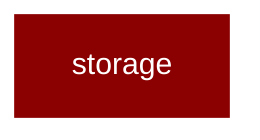

# storage

<Badge color="blue">Core SDK</Badge>

## Overview



PraisonAI Agents Storage Framework.

Provides common storage abstractions for JSON-based persistence with:
- Thread-safe operations
- File locking for concurrent access
- Common session info dataclass

Zero performance impact when not in use through lazy loading.

Example:
    &gt;&gt;&gt; from praisonaiagents.storage import BaseJSONStore, BaseSessionInfo
    &gt;&gt;&gt; class MyStore(BaseJSONStore):
    ...     pass

## Import

```python
from praisonaiagents import storage
```
