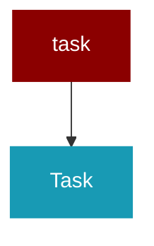

# task

<Badge color="blue">Core SDK</Badge>

## Overview



## Import

```python
from praisonaiagents import task
```

## Classes

<AccordionGroup>
### Task

<Expandable title="Constructor Parameters">

<ParamField query="description" type="str">
   (Required)
</ParamField>
<ParamField query="expected_output" type="Optional">
   (default: `None`)
</ParamField>
<ParamField query="agent" type="Optional">
   (default: `None`)
</ParamField>
<ParamField query="name" type="Optional">
   (default: `None`)
</ParamField>
<ParamField query="tools" type="Optional">
   (default: `None`)
</ParamField>
<ParamField query="context" type="Optional">
   (default: `None`)
</ParamField>
<ParamField query="async_execution" type="Optional">
   (default: `False`)
</ParamField>
<ParamField query="config" type="Optional">
   (default: `None`)
</ParamField>
<ParamField query="output_file" type="Optional">
   (default: `None`)
</ParamField>
<ParamField query="output_json" type="Optional">
   (default: `None`)
</ParamField>
<ParamField query="output_pydantic" type="Optional">
   (default: `None`)
</ParamField>
<ParamField query="callback" type="Optional">
   (default: `None`)
</ParamField>
<ParamField query="status" type="str">
   (default: `'not started'`)
</ParamField>
<ParamField query="result" type="Optional">
   (default: `None`)
</ParamField>
<ParamField query="create_directory" type="Optional">
   (default: `False`)
</ParamField>
<ParamField query="id" type="Optional">
   (default: `None`)
</ParamField>
<ParamField query="images" type="Optional">
   (default: `None`)
</ParamField>
<ParamField query="next_tasks" type="Optional">
   (default: `None`)
</ParamField>
<ParamField query="task_type" type="str">
   (default: `'task'`)
</ParamField>
<ParamField query="condition" type="Optional">
   (default: `None`)
</ParamField>
<ParamField query="is_start" type="bool">
   (default: `False`)
</ParamField>
<ParamField query="loop_state" type="Optional">
   (default: `None`)
</ParamField>
<ParamField query="memory" type="Any">
   (default: `None`)
</ParamField>
<ParamField query="quality_check" type="Any">
   (default: `True`)
</ParamField>
<ParamField query="input_file" type="Optional">
   (default: `None`)
</ParamField>
<ParamField query="rerun" type="bool">
   (default: `False`)
</ParamField>
<ParamField query="retain_full_context" type="bool">
   (default: `False`)
</ParamField>
<ParamField query="guardrail" type="Optional">
   (default: `None`)
</ParamField>
<ParamField query="guardrails" type="Optional">
   (default: `None`)
</ParamField>
<ParamField query="max_retries" type="int">
   (default: `3`)
</ParamField>
<ParamField query="retry_count" type="int">
   (default: `0`)
</ParamField>
<ParamField query="agent_config" type="Optional">
   (default: `None`)
</ParamField>
<ParamField query="variables" type="Optional">
   (default: `None`)
</ParamField>

</Expandable>

<AccordionGroup>
<Accordion title="initialize_memory() -> Any">
  Initialize memory if config exists but memory doesn't
</Accordion>
<Accordion title="store_in_memory(content: str, agent_name: str, task_id: str) -> Any">
  Store content in memory with metadata
</Accordion>
<Accordion title="async execute_callback(task_output: TaskOutput) -> None">
  Execute callback and store quality metrics if enabled
</Accordion>
<Accordion title="execute_callback_sync(task_output: TaskOutput) -> None">
  Synchronous wrapper to ensure that execute_callback is awaited,
preventing 'Task was destroyed but pending!' warnings if called
from non-async code.
</Accordion>
</AccordionGroup>

</AccordionGroup>
