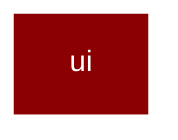

# ui

<Badge color="blue">Core SDK</Badge>

## Overview



UI Integrations for PraisonAI Agents

This module provides UI protocol integrations for exposing PraisonAI Agents
via various frontend protocols.

Available integrations:
- agui: AG-UI (Agent-User Interface) protocol for CopilotKit and compatible frontends
- a2a: Agent-to-Agent protocol
- a2ui: Agent-to-UI protocol

This module uses lazy loading to minimize import time.

## Import

```python
from praisonaiagents import ui
```
