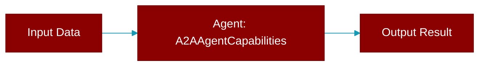

# A2AAgentCapabilities

> Defined in the [**ui**](../modules/ui) module.

<Badge color="orange">Rust AI Agent SDK</Badge>

A2A Agent Capabilities

## Fields

| Name | Type | Description |
|------|------|-------------|
| `streaming` | `bool` | Whether the agent supports streaming |
| `push_notifications` | `bool` | Whether the agent supports push notifications |
| `state_transfer` | `bool` | Whether the agent supports state transfer |

## Source

<Card title="View on GitHub" icon="github" href="https://github.com/MervinPraison/PraisonAI/blob/main/src/praisonai-rust/praisonai/src/parity/ui.rs#L52">
  `praisonai/src/parity/ui.rs` at line 52
</Card>

---

## Related Documentation

<CardGroup cols={2}>
  <Card title="Rust Agent" icon="robot" href="/docs/rust/agent" />
  <Card title="Rust Overview" icon="book-open" href="/docs/rust/overview" />
  <Card title="Rust Quickstart" icon="rocket" href="/docs/rust/quickstart" />
  <Card title="Rust Installation" icon="download" href="/docs/rust/installation" />
  <Card title="Rust Autonomy" icon="wand-magic-sparkles" href="/docs/rust/autonomy" />
</CardGroup>
