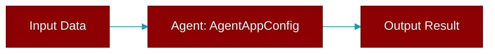

# AgentAppConfig

> Defined in the [**extras**](../modules/extras) module.

<Badge color="orange">Rust AI Agent SDK</Badge>

Agent application configuration



## Fields

| Name | Type | Description |
|------|------|-------------|
| `name` | `String` | Application name |
| `version` | `String` | Application version |
| `host` | `String` | Host to bind to |
| `port` | `u16` | Port to bind to |
| `debug` | `bool` | Enable debug mode |

## Methods

### `new`

```rust
fn new(name: impl Into<String>) -> Self
```

Create a new app config

**Parameters:**

| Name | Type |
|------|------|
| `name` | `impl Into&lt;String&gt;` |


## Source

<Card title="View on GitHub" icon="github" href="https://github.com/MervinPraison/PraisonAI/blob/main/src/praisonai-rust/praisonai/src/parity/extras.rs#L365">
  `praisonai/src/parity/extras.rs` at line 365
</Card>


---

## Related Documentation

<CardGroup cols={2}>
  <Card title="Rust Overview" icon="book-open" href="/docs/rust/overview" />
  <Card title="Rust Quickstart" icon="rocket" href="/docs/rust/quickstart" />
  <Card title="Rust Agent Guide" icon="robot" href="/docs/rust/agent" />
  <Card title="Rust Installation" icon="download" href="/docs/rust/installation" />
  <Card title="Rust Configuration" icon="gear" href="/docs/rust/configuration" />
</CardGroup>
