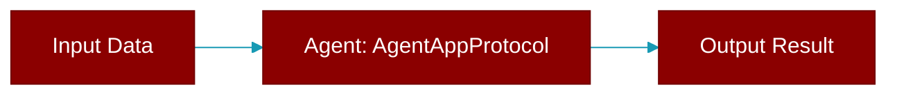

# AgentAppProtocol

> Defined in the [**extras**](../modules/extras) module.

<Badge color="orange">Rust AI Agent SDK</Badge>

Agent application protocol



## Methods

### `name`

```rust
fn name(&self) -> &str
```

Get the app name

### `version`

```rust
fn version(&self) -> &str
```

Get the app version

### `start`

```rust
fn start(&self) -> crate::error::Result<()>
```

Start the application

### `stop`

```rust
fn stop(&self) -> crate::error::Result<()>
```

Stop the application


## Source

<Card title="View on GitHub" icon="github" href="https://github.com/ARC-Solutions/praisonai-rust/blob/main/praisonai/src/parity/extras.rs">
  `praisonai/src/parity/extras.rs` at line 0
</Card>


---

## Related Documentation

<CardGroup cols={2}>
  <Card title="Agents Concept" icon="robot" href="/docs/concepts/agents" />
  <Card title="Single Agent Guide" icon="book-open" href="/docs/guides/single-agent" />
  <Card title="Multi-Agent Guide" icon="users" href="/docs/guides/multi-agent" />
  <Card title="Agent Configuration" icon="gear" href="/docs/configuration/agent-config" />
  <Card title="Auto Agents" icon="wand-magic-sparkles" href="/docs/features/autoagents" />
</CardGroup>
