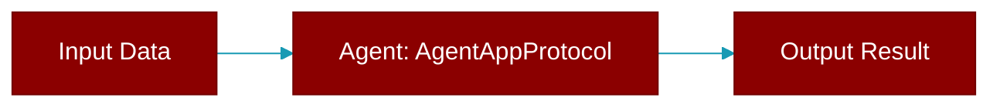

# AgentAppProtocol

> Defined in the [**extras**](../modules/extras) module.

<Badge color="orange">Rust AI Agent SDK</Badge>

Agent application protocol



## Methods

### `name`

```rust
fn name(&self) -> &str
```

Get the app name

### `version`

```rust
fn version(&self) -> &str
```

Get the app version

### `start`

```rust
fn start(&self) -> crate::error::Result<()>
```

Start the application

### `stop`

```rust
fn stop(&self) -> crate::error::Result<()>
```

Stop the application


## Source

<Card title="View on GitHub" icon="github" href="https://github.com/MervinPraison/PraisonAI/blob/main/src/praisonai-rust/praisonai/src/parity/extras.rs">
  `praisonai/src/parity/extras.rs` at line 0
</Card>


---

## Related Documentation

<CardGroup cols={2}>
  <Card title="Rust Agent" icon="robot" href="/docs/rust/agent" />
  <Card title="Rust Overview" icon="book-open" href="/docs/rust/overview" />
  <Card title="Rust Quickstart" icon="rocket" href="/docs/rust/quickstart" />
  <Card title="Rust Installation" icon="download" href="/docs/rust/installation" />
  <Card title="Rust Autonomy" icon="wand-magic-sparkles" href="/docs/rust/autonomy" />
</CardGroup>
