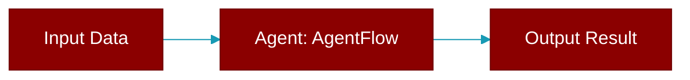

# AgentFlow

> Defined in the [**workflows**](../modules/workflows) module.

<Badge color="orange">Rust AI Agent SDK</Badge>

AgentFlow - Workflow definition with patterns Defines complex workflow patterns like Route, Parallel, Loop.



## Fields

| Name | Type | Description |
|------|------|-------------|
| `steps` | `Vec&lt;FlowStep&gt;` | - |

## Methods

### `new`

```rust
fn new() -> Self
```

Create a new workflow

### `step`

```rust
fn step(mut self, step: FlowStep) -> Self
```

Add a step

**Parameters:**

| Name | Type |
|------|------|
| `step` | `FlowStep` |

### `agent`

```rust
fn agent(self, agent: Agent) -> Self
```

Add an agent step

**Parameters:**

| Name | Type |
|------|------|
| `agent` | `Agent` |

### `run`

```rust
async fn run(&self, input: &str) -> Result<String>
```

Execute the workflow

**Parameters:**

| Name | Type |
|------|------|
| `input` | `&str` |


## Source

<Card title="View on GitHub" icon="github" href="https://github.com/MervinPraison/PraisonAI/blob/main/src/praisonai-rust/praisonai/src/workflows/mod.rs#L313">
  `praisonai/src/workflows/mod.rs` at line 313
</Card>


---

## Related Documentation

<CardGroup cols={2}>
  <Card title="Agents Concept" icon="robot" href="/docs/concepts/agents" />
  <Card title="Single Agent Guide" icon="book-open" href="/docs/guides/single-agent" />
  <Card title="Multi-Agent Guide" icon="users" href="/docs/guides/multi-agent" />
  <Card title="Agent Configuration" icon="gear" href="/docs/configuration/agent-config" />
  <Card title="Auto Agents" icon="wand-magic-sparkles" href="/docs/features/autoagents" />
</CardGroup>
