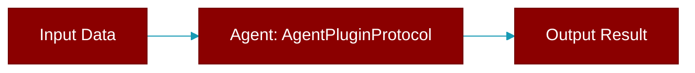

# AgentPluginProtocol

> Defined in the [**plugins**](../modules/plugins) module.

<Badge color="orange">Rust AI Agent SDK</Badge>

Agent lifecycle plugin protocol



## Methods

### `on_agent_created`

```rust
fn on_agent_created(&self, _agent_name: &str) -> Result<(), String>
```

Called when agent is created

**Parameters:**

| Name | Type |
|------|------|
| `_agent_name` | `&str` |


## Source

<Card title="View on GitHub" icon="github" href="https://github.com/MervinPraison/PraisonAI/blob/main/src/praisonai-rust/praisonai/src/parity/plugins.rs">
  `praisonai/src/parity/plugins.rs` at line 0
</Card>


---

## Related Documentation

<CardGroup cols={2}>
  <Card title="Rust Agent" icon="robot" href="/docs/rust/agent" />
  <Card title="Rust Overview" icon="book-open" href="/docs/rust/overview" />
  <Card title="Rust Quickstart" icon="rocket" href="/docs/rust/quickstart" />
  <Card title="Rust Installation" icon="download" href="/docs/rust/installation" />
  <Card title="Rust Autonomy" icon="wand-magic-sparkles" href="/docs/rust/autonomy" />
</CardGroup>
