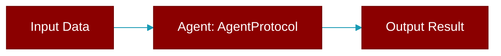

# AgentProtocol

> Defined in the [**protocols**](../modules/protocols) module.

<Badge color="orange">Rust AI Agent SDK</Badge>

Minimal Protocol for agent implementations. This defines the essential interface that any agent must provide. It enables proper mocking and testing without real LLM dependencies.



## Methods

### `name`

```rust
fn name(&self) -> &str
```

Get the agent's name

### `chat`

```rust
fn chat(&self, prompt: &str) -> Result<String>
```

Synchronous chat with the agent

**Parameters:**

| Name | Type |
|------|------|
| `prompt` | `&str` |

### `achat`

```rust
async fn achat(&self, prompt: &str) -> Result<String>
```

Asynchronous chat with the agent

**Parameters:**

| Name | Type |
|------|------|
| `prompt` | `&str` |


## Source

<Card title="View on GitHub" icon="github" href="https://github.com/MervinPraison/PraisonAI/blob/main/src/praisonai-rust/praisonai/src/protocols/mod.rs">
  `praisonai/src/protocols/mod.rs` at line 0
</Card>


---

## Related Documentation

<CardGroup cols={2}>
  <Card title="Agents Concept" icon="robot" href="/docs/concepts/agents" />
  <Card title="Single Agent Guide" icon="book-open" href="/docs/guides/single-agent" />
  <Card title="Multi-Agent Guide" icon="users" href="/docs/guides/multi-agent" />
  <Card title="Agent Configuration" icon="gear" href="/docs/configuration/agent-config" />
  <Card title="Auto Agents" icon="wand-magic-sparkles" href="/docs/features/autoagents" />
</CardGroup>
