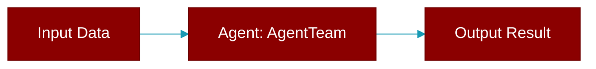

# AgentTeam

> Defined in the [**workflows**](../modules/workflows) module.

<Badge color="orange">Rust AI Agent SDK</Badge>

Agent team for multi-agent workflows Coordinates multiple agents to work together on tasks.



## Fields

| Name | Type | Description |
|------|------|-------------|
| `agents` | `Vec&lt;Arc&lt;Agent&gt;&gt;` | - |
| `process` | `Process` | - |
| `verbose` | `bool` | - |

## Methods

### `is_verbose`

```rust
fn is_verbose(&self) -> bool
```

Check if verbose mode is enabled

### `new`

```rust
fn new() -> AgentTeamBuilder
```

Create a new agent team builder

### `start`

```rust
async fn start(&self, task: &str) -> Result<String>
```

Run the team with a task

**Parameters:**

| Name | Type |
|------|------|
| `task` | `&str` |

### `run`

```rust
async fn run(&self, task: &str) -> Result<String>
```

Alias for start

**Parameters:**

| Name | Type |
|------|------|
| `task` | `&str` |

### `len`

```rust
fn len(&self) -> usize
```

Get the number of agents

### `is_empty`

```rust
fn is_empty(&self) -> bool
```

Check if empty

## Usage

```rust
let team = AgentTeam::new()
.agent(researcher)
.agent(writer)
.process(Process::Sequential)
.build();

let result = team.start("Research and write about AI").await?;
```


## Source

<Card title="View on GitHub" icon="github" href="https://github.com/MervinPraison/PraisonAI/blob/main/src/praisonai-rust/praisonai/src/workflows/mod.rs#L116">
  `praisonai/src/workflows/mod.rs` at line 116
</Card>


---

## Related Documentation

<CardGroup cols={2}>
  <Card title="Rust Agent" icon="robot" href="/docs/rust/agent" />
  <Card title="Rust Overview" icon="book-open" href="/docs/rust/overview" />
  <Card title="Rust Quickstart" icon="rocket" href="/docs/rust/quickstart" />
  <Card title="Rust Installation" icon="download" href="/docs/rust/installation" />
  <Card title="Rust Autonomy" icon="wand-magic-sparkles" href="/docs/rust/autonomy" />
</CardGroup>
