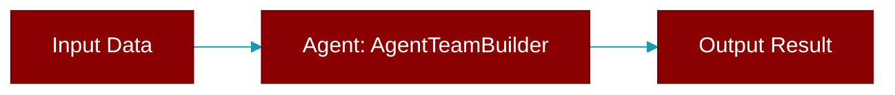

# AgentTeamBuilder

> Defined in the [**workflows**](../modules/workflows) module.

<Badge color="orange">Rust AI Agent SDK</Badge>

Builder for AgentTeam



## Fields

| Name | Type | Description |
|------|------|-------------|
| `agents` | `Vec&lt;Arc&lt;Agent&gt;&gt;` | - |
| `process` | `Process` | - |
| `verbose` | `bool` | - |

## Methods

### `new`

```rust
fn new() -> Self
```

Create a new builder

### `agent`

```rust
fn agent(mut self, agent: Agent) -> Self
```

Add an agent

**Parameters:**

| Name | Type |
|------|------|
| `agent` | `Agent` |

### `agent_arc`

```rust
fn agent_arc(mut self, agent: Arc<Agent>) -> Self
```

Add an agent (Arc version)

**Parameters:**

| Name | Type |
|------|------|
| `agent` | `Arc&lt;Agent&gt;` |

### `process`

```rust
fn process(mut self, process: Process) -> Self
```

Set the process type

**Parameters:**

| Name | Type |
|------|------|
| `process` | `Process` |

### `verbose`

```rust
fn verbose(mut self, enabled: bool) -> Self
```

Enable verbose output

**Parameters:**

| Name | Type |
|------|------|
| `enabled` | `bool` |

### `build`

```rust
fn build(self) -> AgentTeam
```

Build the team


## Source

<Card title="View on GitHub" icon="github" href="https://github.com/MervinPraison/PraisonAI/blob/main/src/praisonai-rust/praisonai/src/workflows/mod.rs#L254">
  `praisonai/src/workflows/mod.rs` at line 254
</Card>


---

## Related Documentation

<CardGroup cols={2}>
  <Card title="Rust Overview" icon="book-open" href="/docs/rust/overview" />
  <Card title="Rust Quickstart" icon="rocket" href="/docs/rust/quickstart" />
  <Card title="Rust Agent Guide" icon="robot" href="/docs/rust/agent" />
  <Card title="Rust Installation" icon="download" href="/docs/rust/installation" />
  <Card title="Rust Agent Team" icon="users" href="/docs/rust/agent-team" />
</CardGroup>
