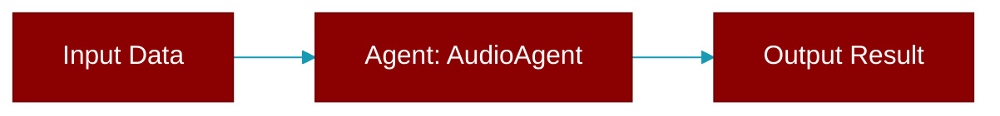

# AudioAgent

> Defined in the [**agents**](../modules/agents) module.

<Badge color="orange">Rust AI Agent SDK</Badge>

A specialized agent for audio processing using AI models. Provides Text-to-Speech (TTS) and Speech-to-Text (STT) capabilities.



## Fields

| Name | Type | Description |
|------|------|-------------|
| `name` | `String` | Agent name |
| `model` | `String` | LLM model (e.g., "openai/tts-1", "openai/whisper-1") |
| `config` | `AudioConfig` | Audio configuration |
| `verbose` | `bool` | Verbose output |

## Methods

### `new`

```rust
fn new() -> AudioAgentBuilder
```

Create a new AudioAgent builder

### `name`

```rust
fn name(&self) -> &str
```

Get agent name

### `model`

```rust
fn model(&self) -> &str
```

Get model

### `speech`

```rust
fn speech(&self, text: &str, output_path: &str) -> Result<String>
```

Generate speech from text (placeholder - requires LLM integration)

**Parameters:**

| Name | Type |
|------|------|
| `text` | `&str` |
| `output_path` | `&str` |

### `transcribe`

```rust
fn transcribe(&self, audio_path: &str) -> Result<String>
```

Transcribe audio to text (placeholder - requires LLM integration)

**Parameters:**

| Name | Type |
|------|------|
| `audio_path` | `&str` |


## Source

<Card title="View on GitHub" icon="github" href="https://github.com/MervinPraison/PraisonAI/blob/main/src/praisonai-rust/praisonai/src/agents/mod.rs#L110">
  `praisonai/src/agents/mod.rs` at line 110
</Card>


---

## Related Documentation

<CardGroup cols={2}>
  <Card title="Agents Concept" icon="robot" href="/docs/concepts/agents" />
  <Card title="Single Agent Guide" icon="book-open" href="/docs/guides/single-agent" />
  <Card title="Multi-Agent Guide" icon="users" href="/docs/guides/multi-agent" />
  <Card title="Agent Configuration" icon="gear" href="/docs/configuration/agent-config" />
  <Card title="Auto Agents" icon="wand-magic-sparkles" href="/docs/features/autoagents" />
</CardGroup>
