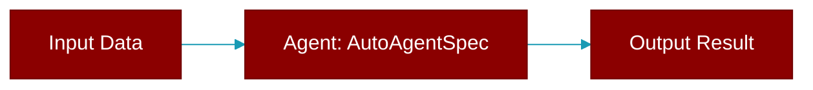

# AutoAgentSpec

> Defined in the [**specialized**](../modules/specialized) module.

<Badge color="orange">Rust AI Agent SDK</Badge>

Auto-generated agent specification

## Fields

| Name | Type | Description |
|------|------|-------------|
| `name` | `String` | Agent name |
| `role` | `String` | Agent role |
| `goal` | `String` | Agent goal |
| `backstory` | `Option&lt;String&gt;` | Agent backstory |
| `tools` | `Vec&lt;String&gt;` | Agent tools |

## Source

<Card title="View on GitHub" icon="github" href="https://github.com/MervinPraison/PraisonAI/blob/main/src/praisonai-rust/praisonai/src/parity/specialized.rs#L370">
  `praisonai/src/parity/specialized.rs` at line 370
</Card>

---

## Related Documentation

<CardGroup cols={2}>
  <Card title="Agents Concept" icon="robot" href="/docs/concepts/agents" />
  <Card title="Single Agent Guide" icon="book-open" href="/docs/guides/single-agent" />
  <Card title="Multi-Agent Guide" icon="users" href="/docs/guides/multi-agent" />
  <Card title="Agent Configuration" icon="gear" href="/docs/configuration/agent-config" />
  <Card title="Auto Agents" icon="wand-magic-sparkles" href="/docs/features/autoagents" />
</CardGroup>
